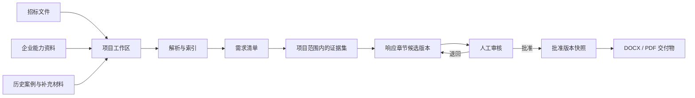
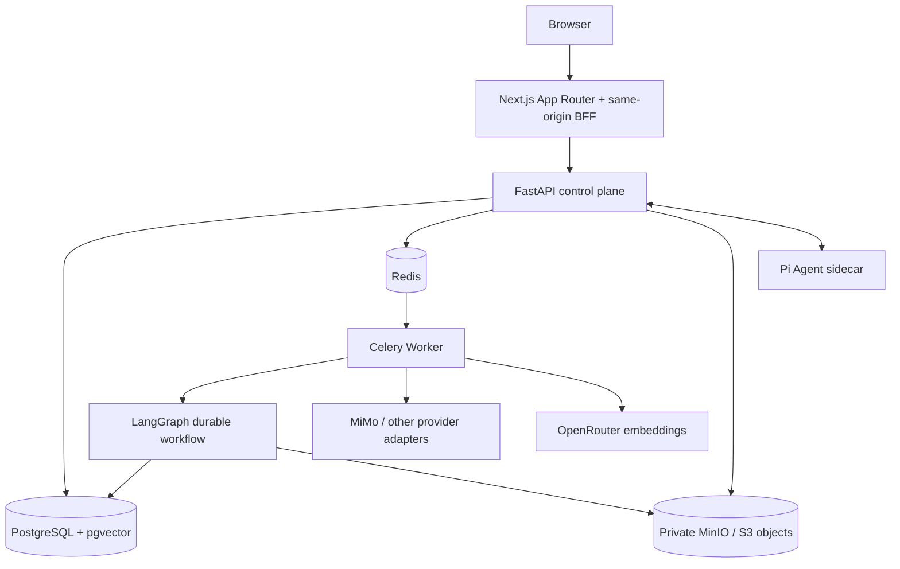

<div align="center">
  
  <h1>BidPilot</h1>
  <p><strong>从招标资料，到可核验的响应交付。</strong></p>
  <p>一个面向投标响应场景的全栈 AI 文档执行工作台。</p>
  <p>
    <a href="https://bidpilot.rglens.com/">在线体验</a>
    ·
    <a href="docs/product/interview-demo-script.md">面试演示脚本</a>
    ·
    <a href="docs/README.md">项目文档</a>
    ·
    <a href="SECURITY.md">安全策略</a>
  </p>
</div>

<p align="center">
  <a href="https://github.com/AVIDS2/BidPilot/actions/workflows/ci.yml?query=branch%3Amaster"></a>
  <a href="LICENSE"></a>
  
  
  
  
</p>

> **当前状态**：BidPilot 的个人面试展示版已经部署到公网，支持真实登录、项目创建、资料上传、解析索引、证据检索、MiMo 起草、人工审核和 DOCX/PDF 导出。本仓库是一个可运行的 controlled pilot / interview-grade reference implementation，不把演示版包装成已经完成企业商业 GA 的 SaaS。公开 GitHub 前还必须完成下方列出的历史凭据清理。

## 为什么是 BidPilot

多数 AI 标书工具把终点定义为“生成一段文字”。真实的投标工作并不是这样：资料散落在 Word、PDF 和历史案例里；每个承诺都需要来源；团队要反复修改和审核；最后还要交付一份可以下载、追溯和复核的文件。

BidPilot 把这条链路放回一个项目工作区：

- 项目是业务入口，资料、需求、证据、响应章节、审核和交付物围绕同一个项目组织；
- AI 负责提取、检索、规划和起草，但没有证据的内容会成为缺口，而不是被包装成事实；
- 起草结果是不可变候选版本，只有人工批准的版本才能进入导出；
- 交互式 Copilot 使用原生 Pi Agent 会话和流式事件，不用关键词猜意图，也不模拟用户发送“确认执行”；
- 长任务由 Celery + LangGraph 持久化执行，页面刷新、模型失败或浏览器断开不改变数据库里的业务事实。

## 先看产品

在线访问 [BidPilot 公网演示](https://bidpilot.rglens.com/)。如果只想在本地阅读产品叙事，先看 [非开发者演示指南](docs/product/non-developer-demo-guide.md)；如果要向面试官讲清 Agent、Harness、RAG、Memory 和全栈边界，使用 [Interview Golden Path](docs/product/interview-demo-script.md)。

公开演示使用的样例资料都在 [`sample-data/bidpilot-demo`](sample-data/bidpilot-demo)，内容是合成的智慧社区项目，不代表真实采购方、供应商或客户。不要把真实投标文件、个人信息或生产密钥上传到公开演示环境。

## 一条完整工作流



用户可以从项目页直接完成资料、需求和响应工作，也可以在明确的项目上下文中进入 Copilot。Agent 是辅助入口，不是所有业务页面的替代品。

## 产品能力

| 能力 | 用户实际得到什么 | 关键保证 |
| --- | --- | --- |
| 项目工作区 | 项目概览、资料包、知识、需求、响应和交付物在同一条业务链上 | 项目 ID 是范围边界，入口不会把所有动作都扔回 Agent |
| 资料处理 | 按招标文件、企业资料、补充资料组织多文件上传 | 文件元数据和处理状态持久化，原始文件进入私有对象存储 |
| 需求与证据 | 从资料中提取要求，并查看来源定位、覆盖状态和缺口 | 检索按组织/项目授权范围执行，缺证据就是缺口 |
| AI 响应 | 以章节为单位进行规划、检索、起草和质量检查 | MiMo、OpenAI-compatible 和 Anthropic-compatible provider 均在适配器后面 |
| 人在回路 | 审核、退回、带反馈重新起草、批准不可变版本 | 审核决定进入 PostgreSQL 和审计记录，不由模型自我批准 |
| 可交付文件 | 下载批准内容的 DOCX/PDF | 导出读取批准版本快照，不导出草稿或退回版本 |
| Copilot Agent | 通过自然语言读取项目事实、发起受控动作和观察进度 | 原生 Pi session、签名能力桥、幂等、取消和持久化事件 |
| 记忆与 RAG | 项目知识、证据集和经审核的记忆投影服务于后续任务 | 业务事实不存放在 prompt、浏览器状态或 Agent 临时记忆里 |

## 为什么这个架构值得看

BidPilot 不是一个把聊天框接到模型 API 的 Demo。它把交互 Agent、业务控制面和长流程执行面拆开，同时保持一个项目级产品体验。



| 层 | 责任 | 不负责什么 |
| --- | --- | --- |
| `apps/web` | Next.js 产品界面、同源 BFF、REST/SSE 投影、响应式工作区 | 不持有 provider key，不直接访问数据库、Worker 或 Pi |
| `services/api` | 认证、组织与项目授权、能力注册、审批、幂等、审计、业务 API、Pi 签名桥 | 不承担重解析和长时间起草 |
| `services/pi-agent` | Pi `AgentSession`、provider-native tool loop、流式生命周期、可信扩展 | 不直接连接 PostgreSQL、Redis、MinIO，不直接写业务事实 |
| `services/worker` | Celery 消费、解析、混合检索、记忆编译、起草、审核恢复、导出 | 不成为浏览器交互入口，不取代 API 授权 |
| `packages/contracts` | 跨服务 ID、状态、事件和文档合同 | 不承载业务路由和隐式副作用 |
| PostgreSQL | 项目、资料元数据、需求、证据、版本、审核、运行事件、审计 | 不只是 Agent checkpoint 的附属数据库 |
| Redis | 队列、outbox 投递和短期协调状态 | 不保存唯一业务事实 |
| MinIO / S3 | 私有源文件和导出制品 | 不把对象 URL 暴露给未授权用户 |

### 两种 Agent 运行时，各做擅长的事

- **Pi** 面向交互式 Copilot：原生会话、流式输出、工具调用、取消、上下文压缩和系统 wake 都属于 Pi 的运行时语义。
- **LangGraph** 面向有持久状态的业务工作流：解析资料、构建证据、起草章节、质量检查、等待人工审核和恢复执行。
- **FastAPI** 是控制面：模型可以提出动作，但授权、配额、审批、幂等、审计和业务写入仍由服务端裁决。
- **没有关键词路由**：用户意图不通过“如果文本出现某个词就触发某个脚本”来判断；动作来自模型原生 tool call 和显式 API contract。

这也是本项目适合 Agent 开发、AI 应用开发和全栈面试的地方：可以同时讲清 Harness、tool governance、HITL、RAG、Memory、队列、数据模型、前端状态投影和部署边界，而不是只展示一次模型输出。

## 仓库结构

```text
BidPilot/
├── apps/web/                 # Next.js 16 + React 19 产品前端
├── services/api/             # FastAPI 控制面与领域模块
├── services/worker/          # Celery + LangGraph 异步执行面
├── services/pi-agent/        # Pi 原生 Agent sidecar
├── packages/contracts/       # 跨服务 Python 合同与 ORM 基础模型
├── sample-data/bidpilot-demo/ # 可公开使用的合成投标资料
├── benchmarks/               # 开发用 BidBench / Retrieval / Memory fixtures
├── scripts/                  # 迁移、验收、备份、质量门禁和运维工具
├── docs/                     # 产品、架构、开发、质量和部署文档
├── compose.yml               # 参考开发拓扑
├── docker-compose.production.yml
└── deploy.sh                 # 低内存 VPS 的顺序构建发布脚本
```

从 [`docs/README.md`](docs/README.md) 开始阅读。它是文档地图；长期有效的产品决策、架构边界、验收条件和运维规则不散落在 README 的临时说明里。

## 本地快速开始

### 前置条件

- Node.js 22+
- pnpm 11.19+
- Python 3.12+
- [uv](https://docs.astral.sh/uv/)
- UI/API 合同验证可以使用 SQLite；完整异步链路需要 PostgreSQL + pgvector、Redis 和 MinIO/S3

当前 Windows 开发基线默认使用直接启动的 Node/Python 进程。Docker Compose 保留给已批准的基础设施环境和公网 VPS；完整约束见 [`docs/development/local-environment-baseline.md`](docs/development/local-environment-baseline.md)。

### 启动 UI/API 合同验证

在仓库根目录执行：

```powershell
corepack enable
pnpm install
uv sync --all-packages --locked

New-Item -ItemType Directory -Force .tmp | Out-Null
$localDbFile = (Join-Path (Resolve-Path .tmp) "bidpilot-local.sqlite3").Replace("\\", "/")
$env:DOCPILOT_ENV = "local"
$env:DOCPILOT_DATABASE_URL = "sqlite:///$localDbFile"
$env:DOCPILOT_APP_URL = "http://127.0.0.1:3300"
$env:DOCPILOT_API_URL = "http://127.0.0.1:8000"
$env:DOCPILOT_CORS_ORIGINS = "http://127.0.0.1:3300"
$env:DOCPILOT_AUTH_REQUIRED = "false"
$env:DOCPILOT_LANGGRAPH_CHECKPOINTER = "memory"
$env:DOCPILOT_AGENT_CHECKPOINTER = "memory"
$env:DOCPILOT_ASSISTANT_ENGINE = "pi"
$env:DOCPILOT_PI_AGENT_URL = "http://127.0.0.1:8787"
$env:DOCPILOT_PI_TOOL_BRIDGE_URL = "http://127.0.0.1:8000/internal/pi/tools/execute"

uv run --directory services/api python -c "from contracts.db import Base; import app.models; from app.db import engine; Base.metadata.create_all(engine)"
```

然后分别打开三个终端。在每个终端启动服务前都重复下面这段配置；PowerShell 的环境变量是进程级的。它会在被忽略的 `.tmp` 目录生成并复用同一份本地桥接密钥，保证 API 与 Pi 能互相验证：

```powershell
$localDbFile = (Join-Path (Resolve-Path .tmp) "bidpilot-local.sqlite3").Replace("\\", "/")
$localSecretFile = Join-Path (Resolve-Path .tmp) "pi-bridge-secret"
if (-not (Test-Path -LiteralPath $localSecretFile)) {
  $bytes = [byte[]]::new(32)
  [Security.Cryptography.RandomNumberGenerator]::Fill($bytes)
  [Convert]::ToBase64String($bytes) | Set-Content -NoNewline -LiteralPath $localSecretFile
}
$env:DOCPILOT_ENV = "local"
$env:DOCPILOT_DATABASE_URL = "sqlite:///$localDbFile"
$env:DOCPILOT_APP_URL = "http://127.0.0.1:3300"
$env:DOCPILOT_API_URL = "http://127.0.0.1:8000"
$env:DOCPILOT_CORS_ORIGINS = "http://127.0.0.1:3300"
$env:DOCPILOT_AUTH_REQUIRED = "false"
$env:DOCPILOT_LANGGRAPH_CHECKPOINTER = "memory"
$env:DOCPILOT_AGENT_CHECKPOINTER = "memory"
$env:DOCPILOT_ASSISTANT_ENGINE = "pi"
$env:DOCPILOT_PI_AGENT_URL = "http://127.0.0.1:8787"
$env:DOCPILOT_PI_TOOL_BRIDGE_URL = "http://127.0.0.1:8000/internal/pi/tools/execute"
$env:DOCPILOT_PI_INTERNAL_SECRET = Get-Content -Raw -LiteralPath $localSecretFile
```

分别运行：

```powershell
# Terminal 1: FastAPI, preceded by the shared environment block
uv run --directory services/api uvicorn app.main:app --host 127.0.0.1 --port 8000

# Terminal 2: Pi sidecar, preceded by the shared environment block
pnpm --filter @docpilot/pi-agent dev

# Terminal 3: Next.js, preceded by the shared environment block
pnpm --filter @docpilot/web dev -- --port 3300
```

访问 [http://127.0.0.1:3300](http://127.0.0.1:3300)。这个 SQLite profile 用于页面、认证和 REST/SSE 合同验证；它不虚构 Redis、对象存储或 Celery 能力。需要真实上传、索引和长流程时，按 [`docs/development/local-environment-baseline.md`](docs/development/local-environment-baseline.md) 准备隔离的 PostgreSQL/Redis/MinIO 环境，并使用专用 `_test` 数据库运行测试。

### 配置模型提供商

模型 key 只放在被忽略的本地环境或服务端 secret store 中。当前生产配置使用 MiMo 作为平台助手/工作流模型，OpenRouter 作为向量模型；代码通过 adapter 保留其他 OpenAI-compatible、Anthropic-compatible 和用户 BYOK 配置。

配置字段、优先级、MiMo 的 `thinking` 约束和生产密钥策略见 [`docs/development/configuration-and-secrets.md`](docs/development/configuration-and-secrets.md) 与 [`docs/development/provider-integrations.md`](docs/development/provider-integrations.md)。不要把 API key 填入聊天内容、README、截图、测试输出或 `VITE_*` 变量。

## 测试与验收

常用检查：

```powershell
# Frontend
pnpm --filter @docpilot/web typecheck
pnpm --filter @docpilot/web test
pnpm --filter @docpilot/web build

# Pi sidecar
pnpm --filter @docpilot/pi-agent test
pnpm --filter @docpilot/pi-agent build

# Worker: 必须提供隔离的 DOCPILOT_TEST_DATABASE_URL，并替换为你的绝对路径
$env:DOCPILOT_TEST_DATABASE_URL = "sqlite:///E:/path/to/bidpilot-worker_test"
uv run --directory services/worker pytest -q

# 生产形状的配置检查，不连接外部 provider
python scripts/production_readiness.py --target production
```

最近一次发布前验证记录：Web 单元测试 `118/118`，Worker 全套测试 `205/205`，Pi package tests `12` 通过；Web typecheck、Next production build、Worker Ruff 和生产 readiness/migration/checkpoint 也通过。严格 lint 仍需结合 CI 里已有的历史 warning 清单阅读，不能把“局部 lint 通过”写成全仓库零 warning。

面试验收建议严格走这条路径：

1. 创建项目；
2. 上传三份合成资料；
3. 查看需求清单、证据定位和缺口；
4. 起草一个响应章节；
5. 退回一次并带反馈重新起草，或直接审核批准；
6. 导出批准内容的 DOCX/PDF；
7. 展示 RuntimeRun、Worker 进度、审计和错误恢复边界。

完整的讲解顺序和预期证据在 [`docs/product/interview-demo-script.md`](docs/product/interview-demo-script.md)。

## 自托管与公网部署

生产拓扑是单节点 Docker Compose，数据库、Redis、MinIO 只绑定本机/容器网络，公网只暴露 HTTPS Web/API 入口。`deploy.sh` 按 Pi、API、Worker、Worker Beat、Web 的顺序构建，适配没有 swap 的低内存 VPS，并在迁移前运行 readiness gate。

不要直接把仓库根目录的生产 Compose 当成普通本地 Compose 执行：生产文件按服务器布局使用 `/app/bidpilot/repo` 和 `/app/bidpilot/.env`。部署、备份、回滚、反向代理和健康检查见 [`docs/ops/deployment-and-runbook.md`](docs/ops/deployment-and-runbook.md) 与 [`docs/ops/vps-pilot-deployment.md`](docs/ops/vps-pilot-deployment.md)。

当前公网入口：

- [BidPilot Web](https://bidpilot.rglens.com/)
- [API liveness](https://bidpilot-api.rglens.com/health)
- [API readiness](https://bidpilot-api.rglens.com/health/ready)

## 安全与密钥审计

### 本次审计结论（2026-09-04）

在准备公开 README 时，对当前 Git 工作树、已跟踪文件和 Git 历史做了密钥形状扫描，并对本地已配置的 MiMo、OpenRouter 和 Supabase 凭据做了“不输出值”的历史精确匹配检查。结论分为两部分：

- 当前工作树和当前分支的跟踪源代码中，没有发现与现有环境匹配的 provider key、私钥、GitHub token、Stripe live/test key 或长 Bearer token；
- 对当前环境中的 MiMo、OpenRouter 和 Supabase 凭据做精确匹配，Git 历史均为 0 次；测试代码里的 `test-only` bridge 字符串是隔离测试 fixture，不是生产凭据；
- 全历史形状扫描发现早期提交 `bcd2fb3c` 的开发文档中曾出现一条旧的 provider key 形状值，共 5 处。它不在当前工作树，也不匹配当前环境凭据，但在历史重写前仍属于公开风险；
- 跟踪的 secret-shaped 文件只有 `.env.production.example` 和 `services/api/.env.example`，它们使用示例/占位值；真实 `.env`、备份、数据库 dump、bundle 和临时文件均不在 Git 跟踪范围；
- 用户提供过的 provider key、Supabase Management PAT 和生产 `.env` 没有写入本 README，也没有写入代码或文档。

**公开阻塞项**：在把仓库设为公开前，必须先在对应 provider 控制台撤销/轮换这条历史旧凭据，再用经过确认的历史清理方案移除 `bcd2fb3c` 及后续历史中的敏感值，并对所有将公开的 refs 重新扫描。只删除当前文件或新增 `.gitignore` 不会清理 Git 历史。

“没有进入当前工作树”不等于“没有暴露”。任何曾经出现在聊天、截图、终端、CI 日志、浏览器录屏或共享机器上的凭据，在把仓库设为公开前都应撤销并重新生成。

### 运行时安全边界

- provider key、数据库 URL、Redis 密码、MinIO/S3 secret、JWT/Fernet secret、Resend/Stripe/Tavily secret 只在服务端环境或 secret store；
- 浏览器只通过 Next same-origin BFF 使用 HttpOnly session cookie，不读取 bearer token 或 provider key；
- Pi sidecar 不持有业务数据库、对象存储或租户授权凭据，业务能力必须经过签名 API bridge；
- Pi host tools、任意 shell、任意文件路径和未经授权的网络访问在生产 sidecar 中关闭；
- 项目访问、审核、导出和配额由 FastAPI/Worker 服务端裁决；
- 日志和用户界面只展示稳定的公开错误类别，不回显原始 provider payload、密钥、数据库 DSN 或内部工具参数。

这是一次性发布前审计，不替代你在开源前后的持续 secret scanning。历史清理完成前，不应把仓库标记为“安全可公开”。发现安全问题请不要开公开 Issue，按照 [`SECURITY.md`](SECURITY.md) 的私下报告流程提交。

## 当前边界，诚实地说

- 这是面试和个人项目展示版，目标是证明一条真实可运行的 AI 应用全链路，而不是声称已经通过企业级容量、合规和用户质量验证；
- 当前公网实例使用 VPS PostgreSQL/pgvector、Redis 和 MinIO。Supabase managed profile 已保留适配边界，但当前 Supabase `bidpilot` 项目处于暂停状态，缺少数据库 Pooler 凭据和 Storage S3 access-key pair，因此没有做半成品切换；
- 导出是批准门禁：只要选定交付物仍有未批准章节，系统会导出“已批准内容”，只有全部章节满足条件时才称为最终文件；
- 当前质量 benchmark 主要是开发控制 fixture，不等同于经过冻结数据集、真实用户评审和长期运营的商业质量证明；
- 尚未宣称企业 SSO/SCIM、水平扩展、完整支付运营、实时协同编辑或通用自主编程 Agent 已达到商业 GA 标准。

这些不是藏起来的遗留问题，而是项目边界的一部分。对应的 Tasks、证据和后续条件记录在 [`docs/development/current-execution-state.md`](docs/development/current-execution-state.md)、[`docs/product/known-limitations.md`](docs/product/known-limitations.md) 和 [`docs/dev-log/progress.md`](docs/dev-log/progress.md)。

## 贡献

欢迎提交 issue、文档改进和经过验证的代码贡献。开始之前请：

1. 阅读 [`docs/README.md`](docs/README.md) 和相关领域文档；
2. 使用合成资料，不上传真实投标文件、个人数据或密钥；
3. 保持 API、Worker、Pi 和 Web 的边界，不把业务事实塞进 prompt 或浏览器状态；
4. 为行为变更补测试，并在 PR 中写清复现步骤和验收证据；
5. 不提交自动生成但未经理解和验证的批量代码。

本仓库的原始 BidPilot 代码使用 MIT License。前端复用的 Kiranism dashboard、ixartz landing composition 和 Wasp Open SaaS 相关结构分别保留其上游归属与许可证，见 [`apps/web/THIRD_PARTY_NOTICES.md`](apps/web/THIRD_PARTY_NOTICES.md)。完成历史凭据清理后，再将仓库切换为公开可见。

## License

原始代码以 [MIT License](LICENSE) 发布。第三方依赖、字体、模板和复用组件仍受其各自许可证约束。
