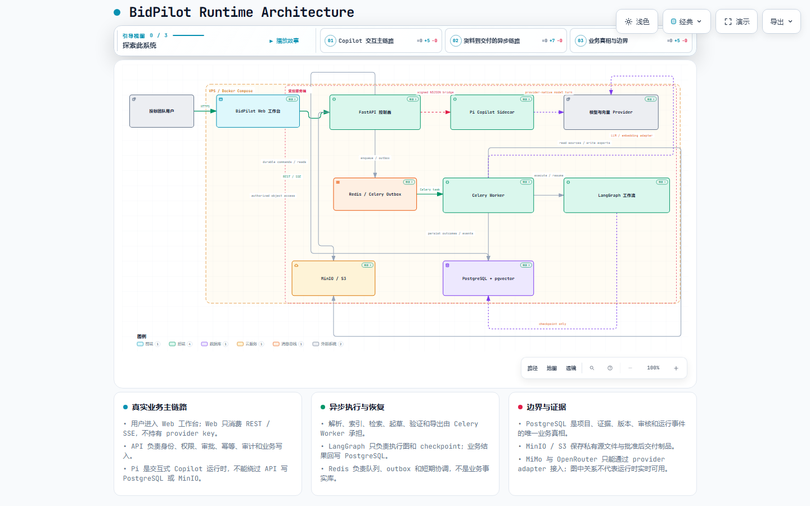

<p align="center">
  
</p>

<h1 align="center">BidPilot</h1>

<p align="center">
  <strong>面向投标响应团队的项目优先 AI 工作台。</strong><br>
  把招标资料、要求和证据，推进成可审核、可交付的响应方案。
</p>

<p align="center">
  <a href="https://bidpilot.rglens.com/"></a>
  <a href="https://github.com/AVIDS2/BidPilot/actions/workflows/ci.yml?query=branch%3Amaster"></a>
  <a href="https://github.com/AVIDS2/BidPilot/blob/master/LICENSE"></a>
  <a href="https://github.com/AVIDS2/BidPilot"></a>
</p>

<p align="center">
  <a href="https://bidpilot.rglens.com/">打开工作台</a> |
  <a href="docs/product/non-developer-demo-guide.md">产品路径</a> |
  <a href="docs/architecture/bidpilot-runtime.architecture.html">系统架构</a> |
  <a href="docs/README.md">项目文档</a>
</p>

<p align="center">
  <strong>项目工作区</strong> | <strong>招标解析</strong> | <strong>证据追溯</strong> | <strong>Copilot</strong> | <strong>团队审核</strong> | <strong>DOCX / PDF</strong>
</p>

<p align="center">
  <a href="#安装">安装</a> |
  <a href="#能力矩阵">能力矩阵</a> |
  <a href="#支持你的团队">团队</a> |
  <a href="#快速开始">快速开始</a> |
  <a href="#记忆模型">记忆模型</a> |
  <a href="#运行模式">运行模式</a> |
  <a href="#文档">文档</a>
</p>

---

> 从一份资料开始，最后得到一份可以审核、可以下载的响应。

<h2 id="bidpilot-是什么"><picture><source media="(prefers-color-scheme: dark)" srcset="assets/tags/light/section-overview.svg"></picture></h2>

BidPilot 把投标团队的资料、要求、证据、响应章节、审核决定和交付文件组织在同一个项目中。

招标文件进入项目后，团队可以逐步完成解析、要求整理、证据核对、章节起草、版本审核和文件导出。每一个重要结论都保留它的来源，每一次修改都保留它的版本。

| 团队工作 | BidPilot |
| --- | --- |
| 招标资料散落在不同文件中 | 项目资料包集中管理，处理进度清楚可见 |
| 关键要求藏在长文档里 | 要求、评分点、优先级和缺口形成清单 |
| 响应内容缺少依据 | 每个响应章节关联要求和证据来源 |
| 团队反复改稿 | 评论、退回、重做、批准和版本记录完整保留 |
| 草稿无法直接交付 | 只从批准版本导出 DOCX/PDF |

<h2 id="能力矩阵"><picture><source media="(prefers-color-scheme: dark)" srcset="assets/tags/light/section-workspace.svg"></picture></h2>

| 能力 | 结果 | 入口 |
| --- | --- | --- |
| 项目工作区 | 一次投标的资料、成员、章节和交付状态 | `项目` |
| 招标解析 | 从 PDF、DOCX、Markdown 等材料整理结构化内容 | `资料` |
| 要求清单 | 要求、评分点、优先级、验证状态和缺口 | `要求` |
| 证据检索 | 在项目范围内找到来源和定位 | `要求` / `响应` |
| AI 响应 | 基于已确认资料起草响应章节 | `响应` / `Copilot` |
| 团队审核 | 评论、退回、复核和批准候选版本 | `评审` |
| 项目知识 | 管理已确认事实、风险、决定和方法 | `项目知识` |
| 交付文件 | 从批准内容生成可下载文件 | `交付` |

<h2 id="支持你的团队"><picture><source media="(prefers-color-scheme: dark)" srcset="assets/tags/light/section-agents.svg"></picture></h2>

同一个项目，连接不同角色的工作：

<table>
<tr>
<td align="center" width="20%"><strong>投标负责人</strong><br><sub>项目全局 · 进度</sub></td>
<td align="center" width="20%"><strong>方案工程师</strong><br><sub>要求 · 证据 · 响应</sub></td>
<td align="center" width="20%"><strong>评审负责人</strong><br><sub>评论 · 版本 · 批准</sub></td>
<td align="center" width="20%"><strong>交付负责人</strong><br><sub>文件 · 留痕 · 导出</sub></td>
<td align="center" width="20%"><strong>Copilot</strong><br><sub>理解 · 推进 · 汇总</sub></td>
</tr>
</table>

| 工作入口 | 负责的事情 |
| --- | --- |
| `项目` | 创建项目、查看准备度、进入项目工作区 |
| `资料` | 上传招标文件、企业资料和历史案例 |
| `要求` | 核对要求、评分点、来源和缺口 |
| `响应` | 逐章节生成和管理候选内容 |
| `评审` | 处理意见、退回、批准和版本决定 |
| `交付` | 导出已经批准的 DOCX/PDF |

<h2 id="安装"><picture><source media="(prefers-color-scheme: dark)" srcset="assets/tags/light/section-install.svg"></picture></h2>

### 公网体验

打开 [bidpilot.rglens.com](https://bidpilot.rglens.com/)，进入工作台。

### 本地要求

- Node.js `22+`
- pnpm `11.19+`
- Python `3.12+`
- [uv](https://docs.astral.sh/uv/)
- 完整资料解析和长流程需要 PostgreSQL + pgvector、Redis、MinIO/S3

<h2 id="快速开始"><picture><source media="(prefers-color-scheme: dark)" srcset="assets/tags/light/section-quick-start.svg"></picture></h2>

1. 创建一个项目；
2. 上传招标文件、企业资料和历史案例；
3. 查看解析结果、要求清单和证据覆盖；
4. 选择响应章节，生成候选内容；
5. 评论、退回或批准章节版本；
6. 从批准版本导出 DOCX/PDF。

示例资料位于 [`sample-data/bidpilot-demo`](sample-data/bidpilot-demo)，是一组公开安全的合成智慧社区投标资料。

<h2 id="记忆模型"><picture><source media="(prefers-color-scheme: dark)" srcset="assets/tags/light/section-memory-model.svg"></picture></h2>

| 记忆范围 | 保存什么 | 帮助回答 |
| --- | --- | --- |
| 当前工作上下文 | 当前项目、资料、任务和待确认事项 | “现在做到哪一步？” |
| 工作记录 | 已完成任务、修改过程和审核决定 | “之前发生过什么？” |
| 项目知识 | 已确认的事实、要求、风险和决定 | “这个项目确定了什么？” |
| 团队方法 | 模板、写作规范、审批规则和流程 | “团队通常怎么做？” |

需要长期保留的项目知识先提出，再确认；它不会因为一次对话结束，也不会因为模型提到某件事，就自动变成正式结论。

<h2 id="运行模式"><picture><source media="(prefers-color-scheme: dark)" srcset="assets/tags/light/section-runtime.svg"></picture></h2>

| 你要完成的事情 | 运行方式 |
| --- | --- |
| 查找项目资料和要求 | 在项目工作区查看，或让 Copilot 汇总 |
| 处理大量文件 | 后台解析和索引，完成后回到项目 |
| 起草响应章节 | 生成候选版本，保留证据和生成记录 |
| 处理修改意见 | 退回当前版本，带反馈生成下一版 |
| 完成团队确认 | 在评审中批准章节和交付版本 |
| 导出文件 | 只导出批准内容 |

<h2 id="copilot"><picture><source media="(prefers-color-scheme: dark)" srcset="assets/tags/light/section-memcode.svg"></picture></h2>

Copilot 直接读取当前项目的资料、要求、证据和工作状态。

```text
查看这个项目的资料、需求和当前准备度，指出缺口并给出来源位置。
```

```text
根据已经确认的资料，起草“技术响应方案”章节；如果依据不足，先告诉我缺什么。
```

它可以帮助团队整理资料、找到依据、推进章节和汇总进度；项目成员仍然掌握审核、批准和最终交付决定。

<h2 id="运行时架构"><picture><source media="(prefers-color-scheme: dark)" srcset="assets/tags/light/section-runtime.svg"></picture></h2>

<p align="center">
  <a href="docs/architecture/bidpilot-runtime.architecture.html">
    
  </a>
</p>

[查看交互式架构图](docs/architecture/bidpilot-runtime.architecture.html) · [查看 Archify 源规格](docs/architecture/bidpilot-runtime.architecture.json) · [查看浏览器验收报告](docs/architecture/bidpilot-runtime.architecture.visual-check.json)

<h2 id="配置"><picture><source media="(prefers-color-scheme: dark)" srcset="assets/tags/light/section-configuration.svg"></picture></h2>

当前平台模型使用 MiMo，向量模型使用 OpenRouter。密钥只放在服务端环境或 secret store，不进入 README、浏览器或聊天内容。

```text
DOCPILOT_ASSISTANT_ENGINE=pi
DOCPILOT_ASSISTANT_MODEL=mimo-v2.5-pro
MIMO_BASE_URL=https://api.xiaomimimo.com/v1
MIMO_API_KEY=<your-mimo-api-key>
OPENROUTER_API_KEY=<your-openrouter-api-key>
OPENROUTER_EMBEDDING_MODEL=qwen/qwen3-embedding-8b
OPENROUTER_EMBEDDING_DIMENSIONS=1536
```

<h2 id="部署"><picture><source media="(prefers-color-scheme: dark)" srcset="assets/tags/light/section-docker.svg"></picture></h2>

公网使用单节点 Docker Compose：Web 和 API 通过 HTTPS 暴露，PostgreSQL、Redis、MinIO 和 Pi 只在服务端内部通信。

```bash
docker compose up --build -d
```

生产部署、迁移、备份、反向代理和回滚见[部署与运行手册](docs/ops/deployment-and-runbook.md)。

<h2 id="API"><picture><source media="(prefers-color-scheme: dark)" srcset="assets/tags/light/section-sdk.svg"></picture></h2>

| API 范围 | 负责什么 |
| --- | --- |
| `/auth/*` | 登录、注册和身份验证 |
| `/projects/*` | 项目和成员范围 |
| `/bundles/*`、`/documents/*` | 资料包、源文件和处理状态 |
| `/requirements/*`、`/retrieval/*` | 要求、检索和证据 |
| `/assistant/*` | Copilot 对话和流式事件 |
| `/memory/*` | 项目知识和个人偏好 |
| `/reviews/*`、`/deliverables/*` | 审核、批准和 DOCX/PDF 导出 |

健康检查：[liveness](https://bidpilot-api.rglens.com/health) · [readiness](https://bidpilot-api.rglens.com/health/ready)

<h2 id="文档"><picture><source media="(prefers-color-scheme: dark)" srcset="assets/tags/light/section-docs.svg"></picture></h2>

| 从这里开始 | 内容 |
| --- | --- |
| [文档地图](docs/README.md) | 产品、架构、开发、质量和运维文档 |
| [产品演示指南](docs/product/non-developer-demo-guide.md) | 不需要代码背景的完整体验路径 |
| [面试演示脚本](docs/product/interview-demo-script.md) | Agent、Harness、RAG、Memory 和导出展示 |
| [架构总览](docs/architecture/overview.md) | 系统层次、请求流和部署演进 |
| [Assistant Harness 运行时](docs/architecture/assistant-harness-runtime.md) | Pi、能力桥、审批、重放和故障边界 |
| [LangGraph 工作流](docs/architecture/execution-and-workflow-architecture.md) | 长任务、恢复、重试和业务状态 |
| [API 与事件合同](docs/architecture/api-and-event-contracts.md) | REST、异步任务和流式事件 |
| [部署运行手册](docs/ops/deployment-and-runbook.md) | 公网部署、健康检查、备份和回滚 |
| [README 调研记录](docs/research/readme-product-narrative-study.md) | 参考项目、版本和采用点 |

<h2 id="开发"><picture><source media="(prefers-color-scheme: dark)" srcset="assets/tags/light/section-development.svg"></picture></h2>

```powershell
git clone https://github.com/AVIDS2/BidPilot.git
cd BidPilot
corepack enable
pnpm install
uv sync --all-packages --locked

pnpm --filter @docpilot/web typecheck
pnpm --filter @docpilot/web test
pnpm --filter @docpilot/web build
pnpm --filter @docpilot/pi-agent build
```

UI 变更使用 Playwright 做桌面和移动浏览器验收。API、Worker、Pi 和导出验证见[测试策略](docs/quality/testing-strategy.md)。

<h2 id="鸣谢"><picture><source media="(prefers-color-scheme: dark)" srcset="assets/tags/light/section-acknowledgements.svg"></picture></h2>

README 的产品排版和视觉节奏主要参考 [AVIDS2/memorix](https://github.com/AVIDS2/memorix)，并核对 [Twenty](https://github.com/twentyhq/twenty)、[Formbricks](https://github.com/formbricks/formbricks)、[Langfuse](https://github.com/langfuse/langfuse)、[Open SaaS](https://github.com/wasp-lang/open-saas) 和 [Cal.com](https://github.com/calcom/cal.com) 的公开 README。参考版本、具体采用点和改写边界见[调研记录](docs/research/readme-product-narrative-study.md)。

Hero 和分节标题图形是 BidPilot 的适配素材；没有复制第三方产品 Logo、截图、用户数字或产品原文。第三方归属见 [`THIRD_PARTY_NOTICES.md`](THIRD_PARTY_NOTICES.md)。

<h2 id="license"><picture><source media="(prefers-color-scheme: dark)" srcset="assets/tags/light/section-license.svg"></picture></h2>

[MIT License](https://github.com/AVIDS2/BidPilot/blob/master/LICENSE)

BidPilot 自身代码按 MIT 发布。第三方依赖、字体、模板、组件和图形资产仍受其各自许可证约束。
