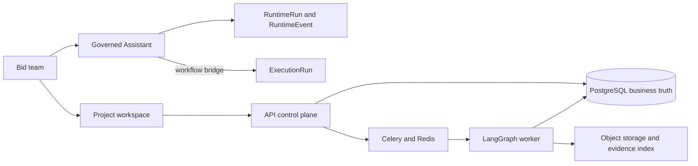

# BidPilot

BidPilot is an evidence-backed AI bid-response workspace. It turns governed
source material into a reviewable proposal workflow rather than treating a
chat transcript as the system of record.

The repository began under the `DocPilot` modular platform name. `BidPilot` is
the product and the only scenario currently in scope.

## What the project demonstrates

- A complete bid-response path: source material -> parsed documents ->
  requirements -> scoped evidence -> versioned draft -> review -> approved
  export.
- A governed web Assistant (`POST /assistant/stream`) that can inspect and
  operate the product control plane through registered capabilities. It has
  idempotent request replay, durable events, missing-input pauses,
  approval/typed-delete confirmation, cancellation, and redacted errors.
- A separate long-running execution plane: API commands persist an
  `ExecutionRun`, Celery delivers the job, and LangGraph coordinates parsing,
  retrieval, drafting, validation and human review interrupts.
- Relational business truth in PostgreSQL: `RuntimeRun`, `RuntimeEvent`,
  `RuntimeApproval`, `ExecutionRun`, `ResponsePlan`, `SectionVersion`, review
  decisions and audit records remain durable even when a model call or browser
  connection fails.
- Source-bound retrieval and memory: evidence locators, tenant/project scope,
  expiry and reviewer-approved memory proposals are enforced before context is
  assembled.

## Runtime boundaries

| Surface | Owner | Purpose |
| --- | --- | --- |
| Interactive product operation | `StreamingHarness` | One bounded, auditable tool-calling turn at a time. |
| Durable bid workflow | Celery Worker + LangGraph | Parse, retrieve, plan, draft, validate, pause for review, and resume. |
| Business truth | PostgreSQL | Projects, source versions, requirements, evidence, approval, audit and runs. |
| Browser | React application | Renders API/SSE projections; it never receives platform or BYOK secrets. |

The Assistant is deliberately not an unrestricted shell or coding agent. It
cannot run arbitrary commands, access the server filesystem, or bypass product
authorization. See
[the capability matrix](docs/architecture/agent-capability-matrix.md) for the
permitted lifecycle actions and governance rules.

## Golden path

1. Create a project and upload a source bundle.
2. Parse/index documents and inspect the requirement ledger plus evidence.
3. Start a section draft through the workspace or a confirmation-governed
   Assistant capability.
4. Review a candidate `SectionVersion`; reject/rerun or approve it.
5. Export only approved content and inspect the durable audit/run trail.

Use the synthetic, public-safe pack in
[`sample-data/bidpilot-demo`](sample-data/bidpilot-demo) for demonstrations.
It does not represent a real procurement, supplier, or customer.

## Verification baseline

The repository's hard gates cover API and Worker lint/tests, API type checks,
database migration health, frontend lint/type checks/tests, and a production
frontend build. Run the local setup and test commands from
[the local environment baseline](docs/development/local-environment-baseline.md).

The current development evaluation pack is a deterministic control fixture. It
proves contract and regression behavior, not that a live model is ready for a
commercial quality claim. A release/pilot claim additionally requires a
reviewed frozen evaluation set, a deployed acceptance run, and a backup/restore
drill.

## Documentation

- [Production and interview master spec](docs/plans/2026-07-27-bidpilot-production-interview-master-spec.md)
- [Assistant Harness runtime](docs/architecture/assistant-harness-runtime.md)
- [Execution and LangGraph workflow architecture](docs/architecture/execution-and-workflow-architecture.md)
- [API and event contracts](docs/architecture/api-and-event-contracts.md)
- [Non-developer demo guide](docs/product/non-developer-demo-guide.md)
- [Interview golden-path script](docs/product/interview-demo-script.md)
- [Operations and deployment runbook](docs/ops/deployment-and-runbook.md)

## Honest scope

BidPilot is a controlled pilot and interview-grade reference implementation,
not an unconditional commercial GA claim. It intentionally does not yet claim
customer-validated output quality, enterprise SSO/SCIM rollout, or a generic
autonomous coding agent. Those require product validation and operational
evidence beyond a green automated suite.
