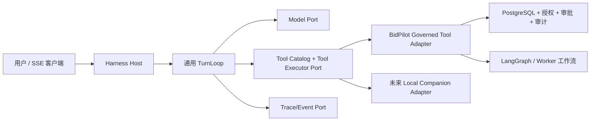

# Pi 式 Harness Agent 规格

> 状态：实施中  
> 日期：2026-08-10  
> 范围：BidPilot 对话型 Agent 运行时；不替代招标业务真相、审批或 LangGraph 工作流。

## 1. 问题与目标

当前 `StreamingHarness` 已能原生调用工具、持久化运行事件、暂停审批和衔接工作流，但这些职责与 BidPilot 的具体工具、提示词策略、计费、MCP 和 SSE 展示混在同一个 2,000+ 行模块里。结果是：

- 在真实异常中，模型看到的失败信息、服务端的终止策略和前端状态未必形成同一个可解释的轨迹。
- 通用循环无法脱离“搜索项目、起草章节”等业务工具独立测试，也无法证明它能服务非招标任务。
- 业务提示词承担了本应由运行时合同保证的参数、暂停、重试、取消和事件顺序约束。
- “计划并执行”被硬编码成一段业务规则，而不是在通用工具循环之上的可选策略。

本规格把 Pi 的可运行核心取为参考：**模型回合 -> 工具调用 -> 工具结果写回上下文 -> 下一模型回合**，并保留其取消、转向输入、会话恢复和紧凑上下文的思想。它不复制 Pi 的本地 shell 权限模型到多租户服务器。

### 成功定义

1. 通用循环只依赖模型、工具目录、工具执行器和持久化事件端口，不引用任何 BidPilot 工具名、项目字段或招标文案。
2. BidPilot 能以一个适配器接入现有受治理能力；授权、审批、审计、配额和 PostgreSQL 仍在服务端执行。
3. 同一内核能用无业务依赖的 `read_note`、`write_note`、`failing_tool` 等确定性工具完成多轮对话、恢复、取消和错误纠正测试。
4. 每轮可从持久化事件恢复已执行的工具结果；不会在重连或重复请求时重做具有副作用的调用。
5. Plan-and-execute 是策略层：可生成/更新面向用户的计划事件，但不拥有业务真相，也不阻塞普通对话。

## 2. 非目标与安全边界

- 不在 API/Worker 容器中开放任意 `bash`、`curl`、文件系统或网络命令。Pi 的 `bash` 是运行在操作者自己机器上的进程权限，直接照搬到多租户 Web 服务会把服务器权限交给模型。
- “用户本地下载”需要独立的本地 companion / CLI，使用用户明确授权的本机目录和进程；本轮先定义协议与内核适配点，不伪造一个在浏览器或服务器后台静默执行的本地 shell。
- 不将 PostgreSQL 业务状态、审批、交付物、文档或工作流状态移入 LLM 上下文或 LangGraph checkpoint。
- 不以外部 benchmark 分数替代真实产品验收。公开工具用于评价设计和回归，不把私有项目资料发送给第三方评估服务。

## 3. 运行时分层

| 层 | 责任 | 不得承担 |
| --- | --- | --- |
| `TurnLoop` | 回合、工具调用关联、最大步数、停止、失败预算、取消、转向输入、上下文追加 | 业务权限、项目 ID 猜测、SSE 文案 |
| `Tool Catalog` | 工具 schema、风险标签、执行器标识、可用性 | 直接执行副作用 |
| `Tool Executor` | 参数验证、执行、标准化结果/暂停/失败 | 模型循环控制 |
| `BidPilot Adapter` | 调用现有 `prepare/execute_capability`、审批、工作流桥接、租户范围 | 直接决定模型下一句话 |
| `Harness Host` | 组装模型上下文、把标准事件投影到 RuntimeEvent/SSE、计费 | 重新实现循环语义 |

## 4. 通用合同

### 4.1 输入和输出

`ModelTurn`：`text`、按返回顺序的 `ToolCall[]`、可选 provider 使用量。  
`ToolCall`：稳定 `id`、`name`、JSON object 参数。  
`ToolOutcome`：

- `succeeded`：`model_payload`（给下一模型回合）、`public_summary`、可选 artifacts / workflow link；
- `failed`：稳定 `error_code`、已脱敏 `public_message`、可恢复标记；
- `paused`：`needs_input` 或 `needs_approval`，当前 run 正常停住；
- `blocked`：策略拒绝，不执行副作用。

每个事件拥有单调序号、`turn_id`、`tool_call_id` 和可选父事件。模型上下文只接收已裁剪、可公开的工具结果；原始异常和内部推理永不进入 SSE 或数据库事件。

### 4.2 循环语义

1. Host 创建 `RuntimeRun` 并发出 `run.started`。
2. Loop 读取一个模型回合；无工具调用则以文本完成。
3. Loop 以模型给出的稳定顺序执行工具，先把调用写入上下文，再把每个标准化结果写回上下文。
4. `paused` 立即结束本次请求，不标记失败；后续用户输入/审批从持久化 action 恢复。
5. 工具失败是模型可见结果，可由模型选择改正或换路；只有达到连续失败预算、不可恢复安全错误、取消或步数上限才终止。
6. 转向输入（steering）和后续输入在当前工具边界被消费，不与正在运行的工具竞争。
7. 重新连接仅重放持久化事件。具有副作用的 tool call 使用 run + call id 幂等键，不重复执行。

### 4.3 并发原则

默认按工具调用顺序执行，保证依赖和审计可解释。只有 Catalog 显式标记 `parallel_safe=True`、无写入、无审批且无数据依赖的只读工具可并发；结果仍按模型源顺序写回上下文。初始实现保守顺序执行。

### 4.4 Plan-and-execute

`PlanPolicy` 是可插拔观察器：它从用户目标和已完成步骤构建简短计划并产生 `plan.proposed` / `plan.updated`。它无权直接调用工具、绕过审批或从计划推断完成。没有计划也必须能完成普通对话。

## 5. BidPilot 适配与本地执行边界

- 当前 CAPABILITY_REGISTRY 迁为 `BidPilotToolAdapter` 的工具目录来源。`prepare_capability_execution` / `execute_prepared_capability` 继续是唯一业务副作用入口。
- LangGraph 只由工具结果产生的 workflow bridge 启动；其 graph 事件映射为通用 artifact / workflow 事件，业务真相仍回写 PostgreSQL。
- 远程公告附件发现与入库保持分离：发现是只读；导入要经人工确认和 artifact 工具。工具失败必须携带可操作的错误类别，不允许模型偷偷改 URL、换协议或无限重试。
- 后续本地 companion 只会实现一个受用户授权的 `LocalExecutionAdapter`：本机命令、工作目录、网络白名单、文件选择和进度由用户控制；服务端收到的是已上传 artifact 或签名事件，绝不接收“执行任意命令”请求。

## 6. 迁移阶段

1. 新建框架无关的协议、循环和确定性 test kit。
2. 将现有 `StreamingHarness` 改为 Host，使用 `BidPilotToolAdapter` 将受治理能力转换为协议 `ToolOutcome`。
3. 将模型流解析放进 `ModelPort`；保持现有 Provider/计费适配。
4. 用计划策略替代提示词中控制循环的业务规则；保留业务提示词仅提供领域知识和用户语言。
5. 新增公共评估导出、轨迹快照和 LangGraph workflow 轨迹断言；将其接入 CI。

## 7. 验收矩阵

| 维度 | 最低案例 | 通过条件 |
| --- | --- | --- |
| 普通对话 | 中文、英文、无工具 | 一轮完成、无虚构工具结果 |
| 通用多工具 | 读笔记 -> 写笔记 -> 读回 | 调用与结果关联、最终回答基于结果 |
| 非招标失败恢复 | 首次参数错误，模型修正后重试 | 保留失败轨迹，第二次成功，不泄露异常 |
| 暂停/审批 | `needs_input`、`needs_approval` | 状态非 failed，恢复只执行一次 |
| 取消/重连 | 模型等待、工具等待、SSE 断开 | 最终状态明确，重放不重做副作用 |
| 安全 | 未知工具、非法参数、敏感异常 | 拒绝/脱敏，无内部信息 |
| 招标金链路 | 搜索/项目/资料/需求/起草/审核/交付 | 可通过业务适配完成，工作流桥接可见 |
| LangGraph | 成功、审批暂停、恢复、失败 | graph 节点轨迹和 RuntimeEvent 均符合预期 |

## 8. 评估方法与来源

| 方案 | 用法 | 决策 |
| --- | --- | --- |
| [LangChain AgentEvals](https://github.com/langchain-ai/agentevals) | strict/unordered/subset/superset 工具轨迹匹配；graph trajectory 评估 | 采用其轨迹比较模型，先做离线确定性评分；可配置后再接 LLM judge |
| [eval-view](https://github.com/hidai25/eval-view) | 工具调用快照与 CI diff | 采用“规范化 trace fixture + 快照 diff”思想，不锁定其 UI 或外部运行时 |
| [ASSERT](https://github.com/responsibleai/ASSERT) | 需求驱动、对抗性行为测试与本地 artifacts | 采用需求到测试矩阵和失败产物保留；不在未审查前引入重依赖 |
| [AgentBench](https://github.com/THUDM/AgentBench) | 通用 agent 学术基准 | 不直接用于产品分数：其环境与租户审批/私有资料不匹配，仅参考任务分类 |
| [Comet](https://github.com/rpamis/comet) | 评估型 skill/harness 工作流 | 参考其可复现工作流/结果产物观念，不引入其完整运行时 |

工程评分由可重复的本地案例产生：合同/安全 35%，循环与恢复 30%，跨领域任务 15%，BidPilot 金链路 15%，LangGraph 轨迹 5%。任何 P0 安全、幂等、终态或数据泄露失败均封顶 59 分。
