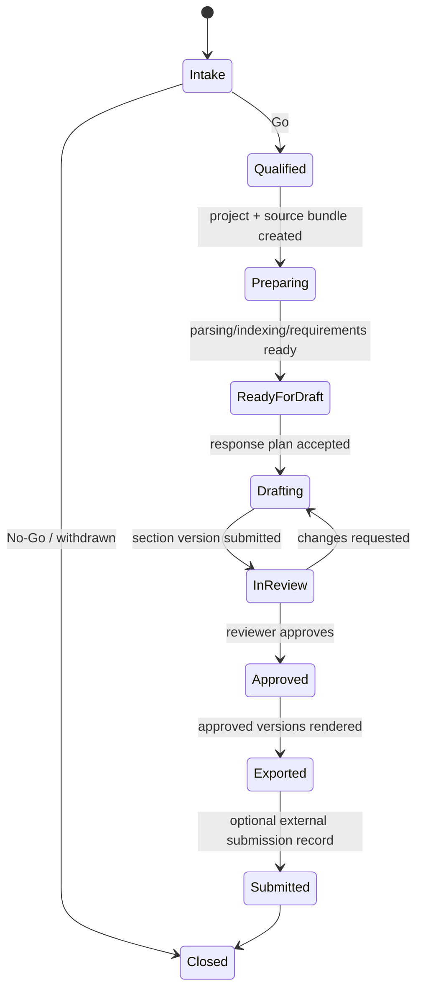
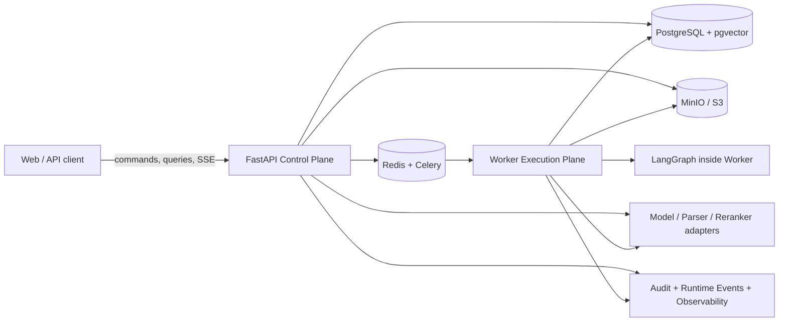
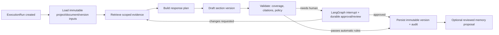

# BidPilot 生产化与面试交付总 Spec

- 状态：实施中；本文件是唯一开发与验收基线，已完成事项与剩余发布门禁均以本文件为准
- 日期：2026-07-27
- 最近更新：2026-08-05
- 产品：BidPilot（DocPilot 的招投标场景包）
- 目标：交付一条可重复验证的、证据驱动的投标响应闭环，并证明 AI 应用、Python 后端、Agent、RAG、异步任务与工程治理能力
- 关联短版发布门槛：[BidPilot 面试交付版 Agent 工程 Spec](2026-07-27-bidpilot-interview-release-spec.md)
- 关联架构：[系统总览](../architecture/overview.md)、[执行与工作流架构](../architecture/execution-and-workflow-architecture.md)、[Assistant Harness Runtime](../architecture/assistant-harness-runtime.md)、[质量门禁 ADR](../adr/0006-quality-evaluation-release-gates.md)

## 0. 这份文档解决什么问题

BidPilot 不能继续按“想到一个界面或 Agent 想法，再临时补一个接口”的方式生长。那会让数据模型、权限、任务状态、提示词、前端假状态和队列行为互相矛盾，最后无法证明系统能可靠处理真实投标资料。

本 Spec 固定以下工作原则：

1. **业务事实先于模型与页面。** 项目、资料、需求、证据、章节、审批、交付物和审计的真相只存在于 PostgreSQL 的可追溯业务记录中。
2. **后端契约先于前端。** 每个能力先定义领域规则、迁移、命令/查询、事件和回归测试；前端只消费这些契约，不维护另一套“看起来正确”的状态机。
3. **Agent 是受治理的执行入口，不是业务数据库。** 模型只能选择被授权的能力；能力通过领域服务写入真相；模型上下文、LangGraph checkpoint、Redis 和浏览器缓存都不是业务真相。
4. **一个产品问题，只有一个主运行时。** 对话执行由 Harness 负责；长运行投标流程由 Worker 内的 LangGraph 负责；不保留多个公开运行时互相兜底。
5. **先交付可重复的一个垂直闭环，再扩展平台。** 不用“多 Agent”“图谱”“企业级”等词替代可运行、可恢复、可评测的事实。

这是一份开发与验收文档，不是营销文案。未通过对应验收时，不得把功能写成“已生产可用”。

---

## 0.1 前端重构宪法（2026-08-05，优先级最高）

> 本节是 BidPilot 前端重构的不可逾越约束。它优先于本文件其他前端表述、旧页面实现、既有 CSS、临时截图和任何“为了先跑起来”的替代方案。若实现与本节冲突，保留本节，撤回实现；不得把冲突实现包装成“风格统一”“渐进迁移”或“先占位”。

### A. 重构目标不是换皮

BidPilot 要废弃旧工作台的视觉体系、导航顺序、标签命名、页面分布、信息架构与组件组合，重新从零构建面向投标响应团队的 Web 工作台。旧前端只能作为尚未迁移业务能力的临时功能参考，**不是**新前端的设计来源。

唯一允许的两份视觉/交互源代码是：

| 责任范围 | 唯一源稿 | 使用方式 |
| --- | --- | --- |
| 完整工作台基座、页面框架、导航层级、栅格、顶栏、列表与画布关系 | `C:\Users\Lenovo\Documents\Playground\opendesign\mockups\linear-reference` | 将原稿组件、DOM 层级、CSS 布局和交互状态迁入 React；以 BidPilot 的真实领域数据替换示例内容 |
| Agent 对话主体、可见思考、搜索、工具组、多级 Runtime、纵向轨道、展开行为和消息排版 | `C:\Users\Lenovo\Documents\Playground\product-ui-reference-library\mockups\claude-reference` | 将原稿组件、DOM 层级、CSS grid 展开逻辑、字体和状态视觉迁入 React；以真实 Runtime Event 替换静态 mock 数据 |

`reference.html`、原稿 `index.html` 和静态数组只能用于逐项对照，绝不作为产品路由、iframe、静态 fallback 或演示假数据来源。交付物必须是 `apps/web/src` 内可维护的 React/TypeScript 组件。

### B. “100% 复刻”的可验证定义

这里的“100%”不是“同样用了浅色背景、一个侧栏和一些圆角”，而是以下约束同时成立：

1. **源码级迁移。** 每个新工作台/Agent 组件先有对应源稿组件、DOM 子树和 CSS 选择器来源；不得凭截图重画一个近似物，更不得先写自己的组件再声称“参考了原稿”。
2. **布局与交互同构。** 保留源稿的节点层级、间距、字体、栅格、滚动容器、展开/收起动画、悬浮与选择态。Claude Runtime 的 `grid-template-rows: 0fr -> 1fr` 多级展开、纵向轨道、缩进、细线和图标状态属于不可替换行为。
3. **真实数据替换 mock。** 允许替换文字、领域对象、图标资产与业务动作；不允许因接入真实数据而改变原稿的视觉层次或把节点塞进自创容器。
4. **逐视图验收。** 每个迁移页面须在与原稿相同的桌面与窄屏视口进行截图对照；结构、层级、滚动和交互状态必须能一一说明。任何有意差异都必须写进本总 Spec 的迁移表并经用户明确确认。

### C. 严格禁止项

以下任何一项出现，即该页面不验收：

1. 复用旧 `PlatformShell`、旧左侧导航、旧标签顺序、旧“仪表盘/项目/设置/文档”等页面分布，或在新页面中 import 旧工作台布局组件。
2. 自创的欢迎语、功能说明、营销区、AI 解释段落、假状态、静态 tool trace、占位 dashboard 或“为了显得丰富”而新增的内容区。
3. 把 Claude 的轨迹替换为圆角卡片列表、通用 `Card` 容器、折叠面板堆叠、Badge 链、终态回放或任意“类似 Claude”的自绘变体。
4. 在浏览器根据关键词、工具名、最终答案、loading boolean 或 mock 数据生成“思考”“计划”“搜索”“成功”等节点。
5. 将附件、工具结果、最终答复、审批或后台运行状态塞进同一个聊天气泡，或以浮层卡片取代 Claude 原稿中的轨迹分支。
6. 把原稿 HTML 直接作为产品页面、iframe 嵌入、复制到 `public/` 后由路由展示，或用静态示例掩盖没有接通的后端。
7. 以“先占位、稍后替换”“视觉统一”“不需要完全一样”为理由突破本节。缺少后端事件时，先补后端，页面保持未实现状态，不造 UI。

### D. 新工作台的信息架构规则

Linear 原稿是**整个新工作台的构建基座**，不是旧应用外面再包一层 Linear 外壳。新路由、导航、页面和动作必须从 BidPilot 真实业务容器反推，并被映射到原稿已有的信息架构模式；旧页面名称与顺序不得迁移。

新工作台的主域只允许由已经存在或本 Spec 已定义的后端实体支撑：

- `Inbox`：审批、分派、评论、失败恢复、需要人工处理的 Runtime/Workflow 事项；
- `My work`：当前用户被分配的需求、章节、审核与截止项；
- `Bid projects`：投标项目、项目状态、资料包、需求、证据、章节、审核和交付物；
- `Knowledge`：组织内容库、已审核证据、来源、版本与检索；
- `Runs`：Harness/LangGraph 运行、质量门禁、失败/重试/恢复；
- `Agent`：独立的 Claude Runtime 画布；
- `Team / Administration`：成员、角色、provider、额度、审计与组织设置，按权限可见。

每个主域在进入导航前都必须同时具备：对应的后端实体/API、真实数据源、至少一个用户动作和可验证结果。没有业务真相的页面不准占位；没有迁移的旧页面不准伪装成新工作台的一部分。

### E. Agent Runtime 的真实 Trace 宪法

Agent 页面必须呈现一个真实的 Harness 运行时，而不是聊天 UI 加“工具已完成”列表。每个 turn 只从服务器的 durable `RuntimeEvent` 和 SSE projection 建树，按服务端 `sequence` 追加；刷新、重连和历史回放得到同一棵树。

1. 当 DeepSeek V4 Flash 开启 thinking 时，后端必须流式保存并发送 provider 实际返回的 `reasoning_content`。这部分是用户选择模型后可见的 provider reasoning，必须原样（仅经 secret/内部标识脱敏）进入 Claude 原稿的 `ThoughtNode`；不得用最终摘要、工具标题或浏览器推断替代它。
2. 若模型返回多段可见 reasoning，它们必须分别按到达顺序插入轨迹，可在工具调用前、工具结果后、后续决策前继续出现。不得等待最终文本后再补写、重排或“回放”。
3. `capability.started/progressed/succeeded/failed`、受控搜索结果、文件读取/写入摘要、审批、取消、LangGraph workflow bridge 和后台 continuation 必须以 `parent_event_id`、`turn_id`、`action_id`、`sequence` 形成多级树，并映射到 Claude 源稿的 `ToolGroup`、`ToolDetail`、`SearchNode` 与 `RuntimeTimeline`。
4. 最终 assistant 文本只能在对应的真实 `message.delta/message.completed` 到达时进入消息区。执行型 turn 的工具/思考/运行节点先到先显示；客户端不得缓存最终正文后先展示，再把 trace 放到底部。
5. 允许显示：provider 可见 reasoning、Harness 明确产生的 `public_analysis`、已脱敏工具摘要、搜索查询与公开结果摘要、文件/产物名称、状态与耗时。禁止显示：原始系统提示词、非公开模型内部状态、原始 tool arguments/result、内部 UUID、`tool_call_id`、异常堆栈、密钥与跨项目数据。
6. Composer 只是功能桥接，保持上传、模型选择、审批、取消和发送能力；它不能替代、覆盖或改写 Claude 对话主体。运行中发送位必须按原稿状态呈现暂停/取消能力，不能无故锁死输入或重复发送。

### E.1 Agent 初始态与产物画布（2026-08-05）

未开始 turn 的 Agent 必须迁移 Linear 原稿的 welcome state：水印、居中 composer、能力入口与示例动作。此时不得显示伪造 Runtime、历史执行输出、说明性空面板，或永久占用宽度的右侧空白画布。

产物画布不是 Agent 的常驻第三栏。只有服务器真实事件声明了可预览产物，且用户显式打开该产物时，才允许按原稿可说明的交互形态打开预览；关闭后主线程恢复全宽。欢迎态与纯对话 turn 始终只有一个主画布。

### F. 滚动、层级与恢复的硬性规则

Agent 主画布采用纵向 flex：唯一消息/轨迹滚动层必须 `min-height: 0; overflow-y: auto`；Composer 是固定底部 sibling，滚动区预留其真实高度。禁止绝对定位遮住消息、父层 `overflow: hidden` 导致无滚动出口、页面和消息区竞争滚动，或把历史列表压在输入框之上。

长运行必须验证：实时新增节点不抢焦点；用户已向上浏览时不强制跳底；手动回到底部后恢复跟随；断线后按 sequence 补齐；取消、失败、审批和后台完成原位更新；同一事件永不重复渲染。

### G. 实施顺序与发布门禁

1. **冻结事件契约。** 先完成/测试 Harness 与 LangGraph 的 `reasoning`、capability、workflow、approval、message 事件、层级和 replay；没有真实流，不写 Trace UI。
2. **迁移 Claude Runtime。** 只迁移 Agent 主体的源稿 DOM/CSS 与真实 SSE fixture，先完成一个真实 turn 的逐事件垂直切片；不修改其他工作台页面。
3. **迁移 Linear 工作台。** 在全新 React 工作台目录中按原稿逐页迁移，并以本节 D 的后端领域替换示例数据；旧工作台不得作为新页面的基础或 fallback。
4. **接入真实后端并验证。** 再接真实 API、权限、加载/失败/空状态、历史回放和跨视图路由；不把 mock 或本地缓存留在生产路径。
5. **视觉与行为验收。** Playwright 桌面/窄屏截图对照、SSE event-order 测试、重连去重、长滚动、取消、审批、后台完成和真实 provider thinking smoke test 全部通过后，才可称“已迁移”或进入部署。

本节未通过时，禁止提交“前端完成”、禁止部署、禁止把静态页面当作产品演示。

### H. 重构门禁台账

| 门禁 | 当前状态 | 已验证事实 | 尚未通过的部分 |
| --- | --- | --- | --- |
| G1-A：Runtime Event/SSE 契约 | reasoning 链路已验证 | `reasoning.delta`、`reasoning.completed` 已升级为 schema `1.2`，有 migration、持久化/replay/SSE 映射与 37 项定向 API Runtime 回归；2026-08-05 以当前后端环境实际调用 `deepseek-v4-flash`，普通调用与 Chat Completions 流式调用均收到 provider `reasoning_content` | 完整 SSE 断线重连演练，以及后续 Claude Runtime React 视图对真实事件的呈现 |
| G1-B：Harness/LangGraph 真实运行证明 | 进行中 | Harness 工具 loop、审批、取消、后台通知和 Worker Runtime 事件已有契约测试 | 真实模型三次 golden run、LangGraph PostgreSQL 恢复和 workflow bridge 端到端证明 |
| G2：Claude Runtime React 迁移 | 未开始 | 源稿、事件模型和禁止项已冻结 | 源码级 DOM/CSS 迁移、真实 SSE 绑定、桌面/窄屏截图对照 |
| G3：Linear Workbench React 迁移 | 进行中 | 新 `workbench-v2` 已是 React/TypeScript 路由；共享壳层按本地 BidPilot Linear 原稿收敛为 `252px` 初始侧栏、全高 `46px` 主栏、原稿 Inter 字体/精确色阶、低对比 hover、键盘焦点与可持久化分栏；中等宽度按原稿收缩为图标导航。项目列表、项目工作集以及 Inbox / My work / Knowledge / Runs / Reviews / Deliverables / 成员 / 管理 / 团队 / 提供商配置 / Account 的真实 API 路由已接入。静态原稿未作为产品路由或 fallback；手动调整的分栏宽度仅保存在浏览器偏好中，业务事实仍来自 API。 | 各页仍需按 `linear-reference` 逐视图复刻密度、滚动边界、hover、窄屏与交互；Agent Claude Runtime 尚未迁移；旧页面隔离和桌面/窄屏截图验收未完成。 |

台账中的“本地实现完成”只表示对应源码与专用 `_test` 数据库回归通过；它不能替代真实 provider、staging、UI 或部署验收。

---

## 1. 产品定位、用户与边界

### 1.1 一句话定位

**BidPilot 是面向投标团队的 AI 投标响应与证据治理平台。**

它帮助团队把一份 RFP/招标文件和企业资料，从接收、解析、需求拆解、证据检索、章节起草、多人审核到批准导出，变成可恢复、可解释、可审计的执行流程。

#### 市场侧角色边界

BidPilot 的工作区用户和付费对象是**响应方（投标人、供应商、服务商）的投标团队**，而不是采购方。采购方提出需求、发布或定向邀请 RFP/RFQ、收集方案、评审并定标；投标团队判断是否参与、组织资质/案例/技术/商务材料并提交响应。公开招标公告只是机会来源之一，大型企业也常以定向邀请 RFP、RFQ 或安全问卷的方式采购。

因此，产品对外必须使用“投标响应”“RFP 响应”“证据治理”等表述，不能含混定位为“招标采购平台”。BidPilot 不承担采购公告发布、供应商招募、评标、定标、合同采购或政府交易门户职责。它帮助响应方更快、更完整、更可证明地交付投标材料；采购方从更规范的响应材料中间接受益，但不是本产品的主用户。

它不是：

- 政府或交易所的电子招投标提交门户；
- 泛化聊天机器人、通用 Agent Builder 或本地 Coding Agent；
- 替代法务、投标负责人或最终签章责任人的自动决策系统；
- 任何文件上传后即可承诺“零废标、零幻觉、中标”的系统。

### 1.2 首批目标用户

| 角色 | 真正要完成的工作 | BidPilot 的价值 |
| --- | --- | --- |
| 投标经理 / Proposal Manager | 判断是否参与、拆解 RFP、安排责任人、控制截止日期 | 有完整的项目、需求、状态与风险视图 |
| 售前 / 方案负责人 | 把公司能力组织为技术响应，并处理缺证据问题 | 从可定位证据起草，而不是从空白聊天框开始 |
| SME（技术、交付、法务、财务） | 回答被分派的要求、提供事实和材料 | 只看到自己负责的需求与可审核的上下文 |
| 审核人 / Approver | 审查承诺、风险、引用与输出版本 | 有评论、拒绝、批准、版本和审计链路 |
| 组织管理员 | 管理人员、项目边界、模型配置、保留策略与使用成本 | 有 RBAC、租户隔离、受控 BYOK、可查询运行记录 |

### 1.3 用户愿意使用而不是直接把文件扔给通用 AI 的原因

通用 Chat、Claude Code 或 Coding Agent 能写文本，但它们默认没有以下产品级约束：

1. **响应范围与责任人。** 一条要求是否必须响应、由谁负责、是否已经通过审核，不能藏在对话记录里。
2. **证据与版本。** 关键主张必须可以回到某份资料、具体版本和 locator；没有证据时必须明确暴露缺口。
3. **审批与风险。** 对外承诺、导出、删除、成本型任务需要可审计的审批，而不是一句自然语言“好的”。
4. **协作与恢复。** 人员、浏览器和后台 Worker 断开后，任务、评论、运行状态和产物仍然可恢复。
5. **组织数据边界。** 每个项目、资料、记忆、模型配置与交付物都有组织/项目/用户作用域。

因此 BidPilot 的竞争点不是“比通用模型更会写”，而是把模型放进一个**可管理的投标生产系统**。

### 1.4 市场参考与差异

公开调研表明，成熟 RFP/Proposal 软件普遍强调内容库、协作分工、审批与权限，而不只强调一次生成：

- Responsive 将 Proposal Management 生命周期描述为资格判断（Go/No-Go）、Kickoff、分工和响应管理，并强调 SME 协作。[来源](https://www.responsive.io/blog/what-is-proposal-management)
- Loopio 强调内容库作为响应的单一事实来源，并提供按问题分派的协作案例。[内容库来源](https://loopio.com/blog/optimizing-rfp-response-process-for-success)，[协作案例](https://loopio.com/case-study/powerschool)
- QorusDocs 公开描述了模板、审批流程、角色权限和内容发布控制。[来源](https://www.qorusdocs.com/blog/what-is-proposal-automation-software)
- [OpenBidKit_Yibiao](https://github.com/FB208/OpenBidKit_Yibiao) 是活跃的 AGPL-3.0 开源桌面工具，重点是本地工作区、文档解析、知识库、可恢复后台任务、标书检查以及 OpenCode/Pi Agent 运行时。

BidPilot 不复制 OpenBidKit 的 Electron 本地工作区或其实现。BidPilot 的可验证差异是：

| 维度 | OpenBidKit 公开定位 | BidPilot 必须做出的明确选择 |
| --- | --- | --- |
| 使用形态 | 本地桌面工具，文件与缓存以本机为中心 | 多租户 Web 工作区，服务器端控制平面是业务真相 |
| Agent | 可切换本地 OpenCode/Pi 运行时 | Web Harness 只能调用已授权的平台能力；不执行任意 Shell/网络 |
| 流程 | 本地生成、编辑、恢复任务 | 需求 -> 证据 -> 草稿 -> 审核 -> 批准 -> 导出，每步有审计 |
| 知识 | 本地知识库与素材复用 | 带组织/项目作用域、来源定位、版本、权限与审批的证据层 |
| 协作 | 不是其公开核心承诺 | 投标经理、SME、审核人、管理员的受控协作是 P1 核心 |

这不代表 BidPilot 现在已经更强。它意味着 BidPilot 的 P0 只能在上述 Web 协同、证据和治理闭环全部可验证后，才具备明确的产品叙事。

---

## 2. 发布目标与非目标

### 2.1 面试/演示发布目标

使用一份公开或脱敏的固定 RFP 资料包，任何演示者可以完成：

```text
创建投标项目
  -> 上传 RFP 与企业资料
  -> 等待解析和索引
  -> 审阅/修正需求矩阵
  -> 检索带 locator 的证据
  -> 由 Assistant 规划并启动某个章节工作流
  -> LangGraph Worker 完成起草与校验
  -> 审核人评论、拒绝重跑或批准版本
  -> 导出批准内容
  -> 回看 RuntimeRun、ExecutionRun、证据、审批和审计
```

这个流程必须可重复三次，不依赖手工改库、浏览器本地假数据、未记录模型对话或某一条偶然成功的上游响应。

### 2.2 生产试运行目标

在发布候选后，系统可供一个受控组织处理脱敏或明确授权的真实资料，满足：

- 租户、项目、文档和记忆的访问边界可测试；
- 上传、解析、索引、起草、审核、导出和失败恢复存在持久记录；
- 外部模型、解析器、对象存储、邮件等均被 adapter 与配置边界隔离；
- 秘钥不进入浏览器、SSE payload、日志、仓库或可下载导出物；
- 有备份、迁移、回滚和故障排查 Runbook；
- 有明确的试用额度、速率限制和人工介入边界。

这仍不是“无条件商业 GA”。GA 需要持续使用数据、支持流程、数据合规评估、可用性目标和客户合同边界；这些是 P2/商业化阶段的工作。

### 2.3 当前明确冻结的事项

以下项目不允许抢占 P0 交付资源：

- 泛化的工作流搭建器、自治 Agent 团队或无限循环的“自我进化”系统；
- 3D 知识图谱、未评测的图数据库、自动用户画像；
- 为了“企业级”名义拆分微服务、上 Kubernetes 或引入多套队列；
- 将 WeKnora、Pi SDK、A2A、MCP Server、vLLM、微调或本地 GPU 推理同时塞进主链路；
- 在后端契约不稳定时做大面积 UI 重构或新增营销页面。

WeKnora 可在 P2 作为知识平台替换/集成候选评估；其价值不等于应立刻替换当前已存在的 PostgreSQL/pgvector 证据层。

### 2.4 当前唯一关键路径：先投标闭环，后 Agent 接管

**当前最重要的不是泛化 Agent，也不是邀请页、品牌、端口、计费、图谱或 UI 动效。**

BidPilot 的第一产品价值是“把真实 RFP 和企业资料变成经审核的投标响应”。如果这个闭环不能稳定运行，Agent 只是一个会调用几个接口的聊天壳；反过来，只有业务能力而没有受控 Agent，也无法证明 Agent 工程能力。因此优先级必须严格如下：

| 优先级 | 唯一目标 | 允许做什么 | 明确不做什么 |
| --- | --- | --- | --- |
| P0-Blocker | 让一条真实黄金流程可运行 | 只修阻止迁移、模型调用、队列消费、幂等或运行恢复的根因，并补回归测试 | 不做“顺手清理”、端口/样式优化、无关配置重构 |
| P0-Core | 建成 AI 投标业务引擎 | RFP 资料 -> 需求/合规 -> 证据 -> 章节草稿 -> 审核/批准 -> 导出 | 不扩展泛化助手、邀请、套餐、图谱、CRM、营销页面 |
| P0-Agent | 让 Harness 接管已验证的业务引擎 | 用 7-9 个受治理 capability 编排核心流程，完成多步、缺参、审批、后台 bridge、重放 | 不做任意工具、本地 Shell、子 Agent 团队或“全能助手” |
| P0-Proof | 证明它可靠 | 固定数据集、E2E、eval、trace、部署演练和面试脚本 | 不先做视觉翻新或更多功能页 |

这里的顺序不是四条可并行的大路线，而是必须依次解锁的临界路径：

```text
可运行 blocker
  -> 一个可审计的投标业务闭环
  -> Harness 驱动该闭环
  -> 评测、演示和生产试运行证据
```

P0-Blocker 只能以一个明确的失败现象进入，例如“缺 migration 导致 `assistant_action_audit` 插入失败”或“已配置 provider 仍无法完成一次结构化模型调用”。每个 blocker 必须有：复现、根因、最小修复、回归测试和完成证据。它不是一个可以消耗数天的“平台优化阶段”。

为 P0-Agent 预留的最小 capability 集合是：

1. 查询项目与资料状态；
2. 查询/筛选需求与合规缺口；
3. 检索项目证据；
4. 创建或更新响应计划；
5. 启动指定章节起草；
6. 查询/恢复/取消后台 Run；
7. 请求审核、读取审核状态；
8. 在已批准条件满足时请求导出。

这些能力必须先由 API/Worker 的黄金路径独立验证，再接给 Harness。Invitation、成员管理 UI、通知、套餐、复杂权限管理、图谱、第三方连接器和视觉重构都不在当前关键路径上。

---

## 3. 领域语言与真实业务生命周期

### 3.1 统一领域词汇

| 词汇 | 定义 | 当前状态 |
| --- | --- | --- |
| Organization | 一个租户/公司，拥有成员、项目、配置与数据保留边界 | 已有基础 |
| Membership / Role | 用户在组织内的身份与权限 | 已有基础，需补权限矩阵测试 |
| Bid Project | 一次投标响应的工作容器；当前数据库/API 中的 `Project` 在 P0 保持兼容 | 已有 |
| Opportunity / Intake | RFP 到来后的立项、截止日期、客户、机会/Go-No-Go 信息 | P1 新领域能力 |
| Bundle | 为项目上传的一组资料 | 已有 |
| Source Document / Version | 原始文件与其不可变版本、解析产物、状态和 locator | 部分已有，需规范版本语义 |
| Requirement Item | 从 RFP 提取、人工可编辑的响应义务/评分点/限制/交付要求 | 已有基础 |
| Compliance Item | 需求对应的责任人、状态、证据、风险和最终响应覆盖情况 | P0 补齐 read model / P1 扩展 |
| Evidence | 可用于支持主张的、具来源和 locator 的片段 | 已有基础 |
| Content Library Entry | 组织级、审批后可复用的答案、案例、能力或模板 | P1 |
| Response Plan | 章节、需求、责任人、截止日期和起草策略的结构化计划 | P0 需显式化 |
| Section / Section Version | 章节和不可变草稿/批准版本 | 已有基础 |
| Review Thread / Decision | 评论、变更请求、拒绝和批准的持久记录 | 已有基础，需完整闭环 |
| Deliverable | 从已批准版本生成的 DOCX/PDF/提交包及其版本 | 已有部分，需发布门禁 |
| Runtime Run | 一个 Assistant 交互回合和其工具/审批事件的持久运行记录 | 已有 |
| Execution Run | 一个后台解析、索引、草拟、验证、导出等流程的持久运行记录 | 已有 |
| Audit Event | 对业务、权限、审批和交付具有追溯意义的不可变摘要 | 已有基础，需覆盖不变量 |

### 3.2 核心业务状态机



当前 P0 必须可靠交付 `Preparing -> ReadyForDraft -> Drafting -> InReview -> Approved -> Exported`。`Intake`、Go/No-Go 和 `Submitted` 可以先作为 P1 实体/状态，但不得在 UI 中伪装成已实现。

### 3.3 投标响应的最小业务闭环

每一次可展示的投标必须满足以下不变量：

1. 每个生成章节属于一个 `Bid Project`、一个 `Response Plan` 和一个明确的版本。
2. 每条关键要求都有状态：`untriaged`、`assigned`、`in_progress`、`covered`、`at_risk`、`waived` 或 `not_applicable`，并有责任说明。
3. 每条引用必须指向一个被授权的 `Source Document Version` 与 locator；没有证据时只能标记 `missing_evidence`，不得捏造出处。
4. 只有已批准章节版本可以进入正式 `Deliverable`。
5. 删除、导出、审批、外部模型调用和高成本流程都在审计中可追溯到用户/运行/请求 ID。
6. 任何任务重试都不能重复创建项目、章节版本、审批或交付物。

### 3.4 P0 审核恢复的实现约束（2026-07-27）

为避免“审核页找不到版本”或“重试覆盖已批准内容”，P0 的章节审核必须遵守以下顺序：

```text
质量审核通过
  -> 持久化 immutable SectionVersion candidate
  -> 创建 / 复用 ReviewThread(section_version_id)
  -> ExecutionRun = awaiting_human + LangGraph interrupt
  -> 人工 approve / reject 写入审核与审计事务
  -> 同一事务创建 sequenced worker.resume_draft outbox
  -> Worker 以相同 LangGraph checkpoint 恢复
```

- 重试同一 `(section, execution run, iteration)` 只能回放同一个候选版本。
- 人工拒绝不能覆盖旧的 `approved_version_id`；后续重起草产生新 iteration 的候选版本。
- 人工批准只允许把其明确的 `section_version_id` 设为批准快照。
- 任何审核决策先提交数据库事务，再请求异步投递；队列不是审核或版本的真相来源。

---

## 4. 目标后端架构

### 4.1 总体形态：模块化单体 + 异步 Worker

BidPilot 当前和近期都采用模块化单体，不为形式拆服务：



模块化单体的边界：

| 平面 | 责任 | 禁止事项 |
| --- | --- | --- |
| Control Plane（API + DB） | 命令校验、权限、领域事务、读模型、运行初始化 | 把长模型调用、文档大解析或 Celery 轮询放在请求线程 |
| Execution Plane（Worker） | 解析、索引、起草、验证、导出、重试与恢复 | 直接信任队列 payload、绕过领域服务写业务状态 |
| Knowledge Plane | 文档版本、分块、向量、全文检索、重排、证据、记忆提案 | 让 embedding 或 graph 结果成为未经审核的业务事实 |
| Integration Plane | Provider、Parser、Storage、邮件、MCP 等适配器 | 在业务服务中散落 SDK/HTTP 调用和密钥读取 |
| Operations Plane | 配置、迁移、日志、指标、trace、备份、发布 Runbook | 把生产故障依赖人工 SSH 猜测解决 |

### 4.2 后端模块边界

建议按领域而非页面或模型名称组织 API 服务。每个领域模块有 `schemas`、`service`、`repository`（必要时）、`router` 和测试；Router 只负责 HTTP/Pydantic/依赖注入，不写业务规则。

| 模块 | 拥有的数据和规则 | 对外命令/查询示例 |
| --- | --- | --- |
| `auth` / `organizations` | 用户、组织、成员、角色、会话 | invite member, change role, resolve actor scope |
| `projects` / `opportunities` | Bid Project、机会、状态、团队、截止日期 | create project, archive project, go/no-go |
| `bundles` / `documents` | 上传、对象、文档版本、解析/索引状态 | upload bundle, retry parsing, document status |
| `requirements` / `compliance` | Requirement、归属、覆盖与风险 | extract, assign, waive, mark at risk |
| `retrieval` / `evidence` | 索引、检索、locator、evidence set | search evidence, build evidence set |
| `planning` / `drafting` | response plan、章节、版本、草拟 | create plan, start draft, redraft section |
| `reviews` / `approvals` | 评论、审核决策、发布门禁 | request review, approve version, reject version |
| `deliverables` / `exports` | 批准快照、渲染产物、下载权限 | create export, get export status |
| `runtime` / `assistant` | RuntimeRun、事件、审批、capabilities | submit assistant turn, cancel, replay events |
| `memory` | proposal、批准、可见范围、context pack | propose, approve, compile context |
| `providers` / `usage` | 服务端模型配置、BYOK 密文、额度/成本 | resolve model, record usage, enforce quota |
| `audit` / `operations` | 不可变审计摘要、运行检索、操作诊断 | query audit, run health/release report |

**禁止的依赖方向：** `router -> ORM` 直写、`LangGraph node -> HTTP router` 回调、`provider adapter -> 业务表` 直写、前端把模型/解析状态当作真相。模块之间通过领域服务、显式 DTO 或受控 repository 协作。

### 4.3 事务、队列与幂等

异步任务必须接受“至少一次投递”，而不是假设 Celery 只会运行一次。

P0 规则：

1. API 在同一个事务内创建领域命令状态和 `ExecutionRun` / `RuntimeRun`。
2. 事务提交成功后才允许投递任务；任务使用 `run_id` 读取数据库，不携带可被伪造的完整业务对象。
3. Worker 每次开始、成功、失败、取消和恢复都持久化状态；写入版本、审批、导出物时使用唯一约束或 idempotency key。
4. 所有浏览器 Assistant 提交必须带 `client_request_id`，它在用户作用域内唯一；普通网络重试只能回放既有 Run，不得再次调用模型或工具。
5. P0 收口时为“数据库已提交但投递失败”的双写问题选定方案：轻量 `OutboxEvent + dispatcher`，或明确且测试过的事务后投递补偿任务。不能继续依赖偶然成功。

不把 Redis/Celery 的运行状态当用户可见真相；它们只是调度机制。

### 4.4 数据隔离与数据库约束

每个可读取/写入的业务对象必须至少携带：

- `org_id`；
- 如果属于项目，则 `project_id`；
- `created_by` / `updated_by` 或等价审计 actor；
- 状态、版本、创建/更新时间；
- 对带来源内容的对象，`source_document_version_id` 与 locator/evidence reference。

服务层要求：

- 每次查询从已认证 actor 的组织范围开始，而不是从浏览器传来的 ID 开始；
- 读取、工具执行、Worker 恢复和导出都重复检查组织/项目边界；
- 外键、唯一约束、check constraint 是不变量的第二层防线；
- 迁移按版本发布，`alembic upgrade head` 是部署硬门禁；
- 迁移须在专用测试数据库和 staging 路径验证，不能由公网运行时首次暴露缺表。

数据库 Row-Level Security 是否引入，属于 P2 设计决策；P0 先将所有 repository/service 的组织边界测试做成 100% 结构性门禁。引入 RLS 前必须评估 SQLAlchemy、迁移、后台 Worker 和管理员查询的可操作性。

---

## 5. Agent 运行时的唯一边界

### 5.1 运行时分工

| 场景 | 主运行时 | 例子 | 业务真相 |
| --- | --- | --- | --- |
| 交互式产品操作 | `StreamingHarness` | “查看这个项目资料状态，再启动第三章起草” | `RuntimeRun`、领域记录、`RuntimeEvent` |
| 长运行投标流程 | Celery Worker + LangGraph | 解析 -> 检索 -> 规划 -> 起草 -> 校验 -> HITL -> 落库 | `ExecutionRun`、章节版本、审核/审批、审计 |
| 外部工具入口 | MCP adapter（受同一 capability policy 管控） | 通过兼容客户端查询项目或启动允许的动作 | 同上 |
| 本地 Coding Agent | 不属于 BidPilot 公网主路径 | Pi/OpenCode 的本地文件工具模式 | 不适用 |

LangGraph 的价值是持久化图状态、条件分支、循环和人工中断。官方文档将其定位为可控制复杂任务的 Agent 框架，并通过 checkpoint/store 提供短期与长期状态机制。[概览](https://docs.langchain.com/oss/python/langgraph/overview)，[持久化](https://docs.langchain.com/oss/python/langgraph/persistence)

这不意味着所有 Agent 都要用 LangGraph。浏览器 Assistant 的一轮工具循环更适合一个小而可审计的 Harness；把它强行包装成另一个公开 LangGraph 会导致重复事件、重复消息和不清晰的恢复语义。

### 5.2 Harness 规范

`StreamingHarness` 是唯一公开 Assistant 路径，职责是：

```text
assemble authorized context
  -> model decides one capability
  -> validate capability arguments and policy
  -> execute domain capability
  -> persist public trace
  -> feed redacted result back to model
  -> continue / ask missing input / request approval / bridge workflow / finish
```

必须满足：

- 每次能力调用使用显式 schema；模型不能写 SQL、Shell、任意 HTTP 或跨项目读取数据；
- 读取、写入、高成本、删除能力有风险等级和授权策略；
- 每个能力通过领域服务，而不是绕过服务直接访问 ORM；
- 单轮最大迭代、最大工具错误次数、超时和取消策略是配置化且有测试的；
- 工具结果分为内部诊断与面向用户的 `public_summary`，默认不显示 JSON、内部工具名、ID、provider 原始报错；
- 模型错误走红脱敏错误和终态 Run 事件，不能把上游原始错误丢给用户；
- 同一 `client_request_id` 的 retry 必须 replay，不得生成两条用户消息或重复执行工具。

### 5.2.1 Harness 工程基线（2026-08-04 更新）

本节吸收《深入理解 AI Agent：设计原理与工程实践》中的 Harness、上下文工程、状态栏、异步事件与评测原则。它是当前 `StreamingHarness` 的唯一演进依据；不以“多几个工具”或“前端看起来在思考”替代真实运行时能力。

#### A. 轨迹、状态栏与循环

一次公开 Assistant turn 的模型轨迹是 append-only 的：

```text
static prefix(system policy + tool schemas)
  + durable conversation/archive context
  + current user request
  + assistant tool call
  + redacted tool observation
  + trusted runtime status
  -> next model turn
```

`trusted runtime status` 必须由服务端代码从 `RuntimeRun`、`RuntimeAction`、`RuntimeApproval`、`RuntimeEvent` 和已关联的 Workflow Run 计算，不能由模型、用户文本、附件、网页内容或前端 boolean 生成。每个模型回合至少包含下列键值事实：

```text
turn=3/8
phase=planning|executing|awaiting_approval|waiting_workflow|finalizing
active_project=<id-or-none>
completed_capabilities=[...]
consecutive_failures=0/3
pending_approval=<id-or-none>
linked_workflows=[<run>:running]
cancel_requested=false
```

状态栏只服务于模型控制，不能被前端伪造成“思考过程”；但用户界面必须渲染 provider 实际流出的可见 reasoning 和 Harness 明确写出的 `public_analysis`。每一轮先持久化 `plan.updated`，随后把模型流区分为 `reasoning`、工具调用和最终答复三类 transcript part；模型请求工具后，服务端把 tool-call 记录加入内部轨迹，执行后追加结构化 tool observation。默认 8 步、战役任务最多 16 步、每个模型回合最多一个 capability、连续 3 次失败熔断，均由代码执行且必须有回归测试。

模型在同一流里产生可见推理、文本和工具调用时，**工具调用优先于最终答复，但不优先于真实可见推理**：`reasoning_content` 或显式 `public_analysis` 必须按到达顺序流给浏览器；若同一模型回合既产生普通文本又产生工具调用，Harness 只能把该普通文本归类为有来源的 `public_analysis` 或安全缓存，绝不能误当最终答复。只有 Harness 确认本轮不再请求 capability 后，才产生 `message.delta` / `message.completed`。

#### B. Durable event first

`RuntimeEvent` 是唯一运行事实，SSE、历史恢复、通知、Timeline 和诊断页都是它的投影。任何直播 SSE 事件都必须能在断线后由 `GET /runtime/runs/{run_id}/events?after_sequence=N` 重放；不得同时发一条临时 SSE 和一条无法关联的持久事件，再由客户端去猜测去重。

事件最小树形语义如下：

```text
run.started
  ├─ reasoning.delta* -> reasoning.completed
  ├─ plan.updated (turn_id, phase, budget, public_summary)
  │    ├─ capability.started (capability, action_id)
  │    │    ├─ capability.progressed (only actual external progress)
  │    │    ├─ approval.requested / approval.resolved
  │    │    └─ capability.succeeded | capability.failed
  │    └─ workflow.linked (workflow_runtime_run_id, execution_run_id)
  └─ message.delta* -> message.completed
run.completed | run.failed | run.cancelled
```

`parent_event_id`、`turn_id` 和 `action_id` 用于稳定分组；它们不是展示性字段。`reasoning.delta` 仅承载模型或 Harness **实际显式输出给当前用户**的可见推理文本：例如 DeepSeek thinking mode 返回的 `reasoning_content`，或由 Harness 明确要求输出并标记为 `public_analysis` 的执行分析。它必须带 `source`、`visibility`、`sequence` 和脱敏结果，供同一授权范围内的 reconnect/history 回放；前端不得根据关键词、工具名或最终答案自行生成这一层。

禁止持久化或展示的仍是：未由 provider API 显式返回的内部状态、system/developer prompt、原始 tool arguments/result、未授权附件正文、堆栈、数据库内部 ID、密钥及跨组织运行数据。大体积产物保存于领域对象/受控记录，Runtime Event 只保留可读引用句柄和必要状态。

#### C. 工具、Skills 与安全边界

Capability 是稳定、带 Pydantic schema 的领域动作；Skill 是可按需加载的程序性 SOP；两者都不是权限来源。工具描述必须包含“何时使用、何时不要使用、输入、输出、风险、后续动作”，服务端仍独立验证 project scope、角色、参数、额度和审批。禁止工具层静默篡改模型参数。

Skill 采用渐进披露：静态前缀只包含名称、摘要、`use when` / `do not use when`；命中后才加载完整 `SKILL.md`，需要细节时继续加载子文档。不得依据关键词把所有 Skill 正文塞进每一轮系统提示词，也不得把未验证的网页、附件、模型输出自动升级为 Skill、长期记忆或权限规则。

#### D. 暂停、后台任务与唤醒

缺参、审批、取消、外部工具结果、Worker/LangGraph 进度和计时器都是持久事件，不是 SSE 连接存活时才存在的内存状态。异步 capability 必须具有明确的 `start`、`status`、`cancel` 语义；启动长工作流只返回受控 run 标识并创建 `workflow_bridge`，Worker 负责持续写入 child Runtime Event。

P0 中，工作流终态通过持久通知和事件进入下一次 Harness 回合，且绝不能重复执行原 capability。后续 P1 的自动继续必须由独立、幂等的事件消费者创建新的 continuation Run；不得从 HTTP SSE 协程或进程内 hook “偷偷继续”。紧急取消在模型或工具边界生效；非紧急外部事件排队到当前原子步骤结束后消费。

#### E. 上下文压缩与长期记忆

静态 system/tool prefix 保持稳定以利缓存；动态上下文按预算追加。先限制工具结果、删除噪声、保留领域引用句柄，再做结构化归档摘要；不要每轮重新总结全部对话。归档摘要至少保留：目标、已验证事实及来源、已执行动作及结果、关键约束、审批/待办、失败和恢复策略、项目/章节/运行标识。压缩失败需要熔断，不得无限调用模型烧额度。

会话轨迹、项目知识、用户长期偏好是三类不同数据：聊天历史不自动成为记忆；记忆必须有用户/组织 scope、来源、置信度、时效和可撤销性；检索到的证据与外部内容一律以不可信数据包注入，不能覆盖 system policy 或授权范围。

#### F. 验收与可观测性

Harness 修改必须新增或保持以下可执行验证：

1. 单轮“查项目 -> 查资料/需求 -> 启动章节 Workflow”按事件顺序重放，且 Timeline 无重复消息/工具；
2. provider 在工具调用前或工具之间输出可见 reasoning 时，浏览器按 `sequence` 先看到 reasoning 节点、再看到对应工具节点，并在工具结果后继续追加 reasoning 或最终答复；最终答复只出现一次；
3. 相同 `client_request_id`、断线 reconnect、审批恢复、取消、后台 Worker 完成后回看均不重复扣费、写入或发消息；
4. 三次连续失败、超步数、审批过期、模型配置不兼容、工具参数不完整均产生稳定错误码和安全终态；
5. Prompt-injection、跨项目访问、未批准写入/导出、secret/原始 provider 错误泄露的回归测试为 100%。

“看起来像 Claude/Codex 的 Timeline”不是后端验收条件；可靠的事件树、可重放状态、明确控制循环才是。前端只能消费本节事件契约，不能自行伪造计划、成功、进度或审批状态。

### 5.3 LangGraph 投标工作流规范

当前 Worker 已存在的核心图节点包括 supervisor、RFP parser、memory context、knowledge retriever、content plan、section drafter、quality reviewer、human approval、persist result 和 memory proposals。P0 不重写成另一套图，而是把它收敛到以下输入/输出约束：



规范：

1. 图输入只包含稳定 ID、版本、授权 scope 和配置快照；不要将整份原文或浏览器状态作为唯一输入。
2. 每个节点输入/输出应有 Pydantic/TypedDict 契约，并可离线单测。
3. 图节点不得直接暴露成 API，也不得绕过 `ExecutionRun` / 领域审核服务。
4. `interrupt()` 只暂停执行；批准、评论、拒绝和恢复必须同时写入独立业务记录。
5. Checkpoint 用于恢复执行，不替代项目、版本、审批或审计的关系型真相。
6. 任何模型生成都先成为候选版本，不能直接修改已批准版本或导出物。

### 5.4 已收口的公开运行时与剩余验证

仓库历史上曾同时存在 `StreamingHarness`、`runtime/operator_graph.py`、`runtime/operator_adapter.py` 与 `agent/graph.py` 等路径。公开 Assistant 现在固定为：`POST /assistant/stream` -> `stream_runtime_assistant_response` -> `RuntimeRun` / `RuntimeEvent`。不再按 rollout flag 在公开请求中切换到旧服务。

已完成的契约：

1. 新写入事件使用 Runtime schema `1.1`；读取端兼容既有 `1.0` 记录。
2. Harness、确定性降级路径和 Worker workflow bridge 都写入同一套 durable `RuntimeEvent`；前端只能按 `run_id + event_id/sequence` 重放，不能伪造成功状态。
3. Workflow 子运行按父 Run 的 `workflow.linked` 事件 sequence 排序，而不是按易漂移的时间戳排序。
4. `client_request_id` 在 Assistant 与直接 drafting 请求上都参与幂等约束；重放发生在额度预留和模型调用之前。
5. 失效或已删除的 BYOK provider 配置会明确拒绝 retry，绝不回落使用平台额度。

仍未完成的发布门禁：

1. 在干净 PostgreSQL 环境跑完整 migration、PostgresSaver checkpoint、SSE reconnect/replay 和真实 Worker continuation；SQLite 单测不能替代它。
2. 对真实平台模型跑固定 golden run 三次，证明停止条件、错误脱敏、审批恢复和 quota 不会重复扣费或重复写入。
3. 清理或明确隔离不再被公开入口使用的旧运行时模块，并在提交拆分时记录其删除期限。

---

## 6. 文档、检索、证据与记忆架构

### 6.1 文档处理管线

#### 当前 P1-A 事实与 Document Intelligence v2 路线

当前实现已完成 **P1-A 高频投标资料补齐**：格式白名单与签名校验后，PDF/DOCX/TXT/Markdown、DOCX 表格、XLSX 工作表和 CSV 都会进入统一解析管线；稀疏文本 PDF 页会在 Worker 内调用已安装的本地 Tesseract（`chi_sim+eng`）做 OCR。结果保留 parser 版本、`normalized_text`、页/表/工作表 locator 与显式 diagnostics。OCR 没有静默云端 fallback：未安装二进制、语言包缺失、渲染失败、超时和无可提取文本都会作为可查询失败原因持久化，不能被伪装为“已解析”。

当前本地 OCR 只覆盖扫描 PDF 的基础中英文字识别，不宣称完成图片、复杂版面、PPTX、表格视觉结构或手写识别。`DOCPILOT_OCR_ENABLED` 与 `DOCPILOT_OCR_LANGS` 是 Worker 容器显式配置，默认镜像不下载任何外部模型，因此不会在开发机 C 盘产生模型缓存。

后续文档智能按以下顺序继续：

1. **P1-B：视觉与版面理解。** 在固定评测集证明收益后，再评估图片、复杂 PDF、PPTX 的布局/视觉模型 fallback；视觉模型输出只能成为带页码/区域定位的候选证据，不能直接成为业务事实。首选候选是 PP-OCRv5 Mobile 的本地 CPU 部署，但只能作为可选 Worker profile：模型目录必须显式挂载到项目数据盘，先记录镜像增量、吞吐、准确率和失败降级，再允许启用。
2. **模型协同与成本治理。** 解析、OCR、视觉与生成模型的级联不是当前默认能力。只有在质量、延迟、成本和失败降级都有 benchmark 后，才可由 adapter/router 引入，不允许凭模型名称或提示词假装“大小模型协同”。

验收标准不只是“能读到文字”：每条进入检索或引用的内容必须保留解析方法、版本和稳定 locator；解析失败必须显式可见，不能被空文本或模型猜测伪装为成功。

```text
upload -> object storage -> file validation -> parser/OCR -> normalized document version
       -> structural blocks/tables/pages -> chunks -> embedding + full-text index
       -> retrieval candidates -> rerank -> evidence links -> draft/review/export
```

每一步均有状态与失败原因：

| 阶段 | 必须持久化的内容 | 失败处理 |
| --- | --- | --- |
| 上传 | 文件元数据、hash、对象地址、提交人、项目范围 | 文件类型/体积/恶意文件拒绝，保留安全审计 |
| 解析 | parser 版本、文档版本、页/块/表格 locator、状态 | 可重试，不覆盖旧成功版本 |
| 索引 | chunk、embedding 模型版本、全文索引版本 | 允许重新索引，保留版本关联 |
| 检索 | query scope、候选、重排、降级原因 | 无证据时显式返回 `missing_evidence` |
| 生成 | evidence set、prompt/context policy、输出候选版本 | 不能用未授权或无 locator 的内容做引用 |

P0 文件安全最低要求：允许类型白名单、大小/页数限制、对象存储私有访问、解析器超时、路径净化、上传文件不直接作为系统指令。后续生产试运行再评估恶意文件扫描和隔离 parser worker。

### 6.2 RAG 设计

当前 pgvector + 全文检索 + RRF + reranker 的方向正确，P0 不替换向量库。要补的是可证明性：

1. 所有召回先按 `org_id`、`project_id`、文档可见性和版本过滤，再做 dense/sparse 检索。
2. RRF 合并后进行 rerank；每个 evidence candidate 保留分数、来源、locator、文档版本和被选中原因。
3. Draft 前生成有上限的 `EvidenceSet`，并记录未满足的 Requirement；模型不能凭“相似内容”伪造出处。
4. 引用校验应检查 locator 是否存在、document version 是否仍有效、证据是否属于当前授权范围。
5. 检索服务必须给出降级状态（例如 embedding provider 不可用时的关键词 fallback），而非暗中改变回答可信度。

评测必须覆盖：Recall@K、locator 有效率、跨项目拒绝、必要证据命中、无证据降级和 rerank 对比。

### 6.3 组织内容库与复用

成熟投标产品的内容库不是“把所有历史文件都塞给模型”。P1 要建立 `ContentLibraryEntry`：

- 组织范围但有分类、行业/场景标签、所有者、有效期、审核状态；
- 可复用答案、案例、能力说明、模板和附件；
- 每条内容记录来源和版本，允许被废弃、替换与审核；
- 被用于某个 Bid Project 时记录引用，便于追踪“哪些投标用了哪条企业承诺”；
- 允许内容所有者/SME 批准后发布，不允许模型把草稿自动提升为组织事实。

### 6.4 记忆与 LLM Wiki

BidPilot 当前的正确方向是“source-bound proposal -> reviewer approval -> authorized retrieval”，而非自动建立用户画像或让 Agent 把对话当事实。

采用四层记忆：

| 层 | 内容 | 写入规则 | 读取规则 |
| --- | --- | --- | --- |
| Working | 当前 Run 的目标、已选择项目、未完成审批 | 当前运行时 | 当前 Run |
| Episodic | 已完成 Run 的简要结果、失败/恢复原因 | 自动摘要但带 Run/来源 | 受组织/项目范围限制 |
| Semantic | 已审核的组织能力、项目事实、历史经验 | proposal + evidence + approval | 只召回 active 且授权内容 |
| Procedural | 经审核的操作流程/Skill | 人工维护版本 | 与 capability policy 一起注入 |

Prompt 组装顺序固定为：

```text
system policy
-> actor / org / project authorization
-> selected procedural skill
-> unresolved task state and approval state
-> compact conversation summary + recent turns
-> staged attachment metadata
-> scoped evidence and approved long-term memory
-> current user request
```

超过 context budget 时必须保留未完成任务、项目绑定、审批和来源，生成/更新可追溯摘要；禁止静默截断使模型忘记审批或项目范围。

知识图谱继续遵守 [ADR 0009](../adr/0009-reviewed-memory-graph-projection.md)：当前只做可审核的 proposal ledger，不建立 3D 可视化，不把 graph row 当事实。WeKnora、图谱或 Agentic RAG 只能在独立 benchmark 证明其提升 evidence coverage 且不降低隔离/引用可靠性后，引入 adapter 评审。

---

## 7. 核心业务能力清单

### 7.1 P0：必须完成的投标响应能力

| 能力 | 后端定义 | 验收证据 |
| --- | --- | --- |
| 项目立项 | 创建项目、团队、场景、基本元数据 | 项目有组织范围、审计和幂等创建 |
| 资料包 | 上传、版本化、解析、索引与重试 | 每份文件可见 parse/index 状态与失败原因 |
| RFP 需求矩阵 | 提取、人工校正、分配、覆盖状态 | 至少一组需求可追溯到文档 locator |
| 证据检索 | 混合检索、重排、受范围约束的 EvidenceSet | 有效 locator 或明确 `missing_evidence` |
| 响应规划 | 章节与 requirement/evidence/owner 的映射 | 计划可保存、修改、审计 |
| 章节起草 | Worker 异步起草候选版本 | 版本、输入 evidence、Run、模型配置快照可追溯 |
| 质量校验 | 覆盖/引用/结构/风险检查 | 校验结果是结构化记录，不只是模型文本 |
| 审核与批准 | 评论、拒绝重跑、批准 | 导出只接受批准版本 |
| 交付物 | DOCX/PDF 或至少一种稳定格式的批准快照导出 | 交付物哈希、版本、权限、审计可查 |
| Assistant 入口 | 受控多步工具能力与 Workflow bridge | 同轮可完成读取+规划+启动，带审批和 replay |

### 7.2 P1：让产品接近真实团队使用的能力

| 能力 | 用户问题 | 后端优先实现 |
| --- | --- | --- |
| Go/No-Go | 这个机会值不值得投入？ | Opportunity、评分维度、风险/能力缺口、决策审计 |
| 文档智能 v2 | 扫描件、表格和非纯文本资料如何可靠进入证据链？ | 按 6.1 的 P1-A 实现格式识别、原生解析、DOCX 表格、XLSX/CSV、扫描 PDF OCR 与统一 locator；先评测后扩展视觉模型 |
| 团队与 SME 协作 | 谁回答哪条要求？何时逾期？ | requirement assignment、任务、提及、状态、通知事件 |
| 截止日期与计划 | 哪些章节拖慢整体交付？ | milestone、SLA、依赖、风险 read model |
| 组织内容库 | 如何复用已验证的答案而非重复找文件？ | ContentLibraryEntry、审核、生命周期、引用追踪 |
| 合规与废标风险 | 哪些硬性条款尚未覆盖？ | requirement type、mandatory flag、coverage/risk rules |
| 变更管理 | RFP 新版本改变了什么？ | DocumentVersion diff、requirement impact、重新审核任务 |
| Q&A / Clarifications | 客户澄清如何影响答案？ | clarification record、关联需求、变更审计 |
| 通知与订阅 | 谁该知道审批、失败和到期？ | domain event -> email/in-app adapter，避免直接在服务层发邮件 |

### 7.3 P2：商业化/规模化后再做

- SSO/SAML/SCIM、精细数据保留和企业审计导出；
- CRM、招标门户、SharePoint/Drive 等 connector；
- 组织级 Usage、计费、发票、套餐和自助升级；
- 客户自带模型的完整生命周期、模型评测和路由策略；
- 多区域/高可用/灾备、数据库 RLS、对象存储生命周期；
- 经 benchmark 批准的 WeKnora/Agentic RAG/知识图谱适配；
- 多语言、无障碍、完整移动端和行业模板市场。

---

## 8. API、事件与前端消费契约

### 8.1 API 先行流程

每个功能按以下顺序开发：

```text
领域规则与状态机
-> PostgreSQL schema / migration / constraints
-> command and query DTO
-> service + authorization + transaction
-> worker/capability integration
-> unit/integration/contract tests
-> OpenAPI/event fixture
-> frontend read model and interaction
```

没有完成前六步，不开始做“漂亮页面”。前端发现缺少状态时，应补充后端状态/事件契约，而不是用本地 boolean 猜测。

### 8.2 命令与查询原则

- 命令返回稳定资源或 `202 + run_id`；耗时操作不得伪装同步完成。
- 查询返回领域 read model，不返回 ORM 内部结构或 provider 原始 payload。
- 所有 mutation 支持 idempotency（浏览器 request ID、导入 hash、版本 fingerprint 等）。
- API 错误使用稳定 `code`、用户可见 `message`、关联 `run_id/request_id`，原始异常仅进安全日志。
- OpenAPI 是客户端/Agent/MCP 的公共契约，contract test 不能只靠手工网页验证。

### 8.3 Runtime 事件协议

Assistant 和后台 Workflow 都以持久化 Runtime Event 为源，SSE 是实时投影。每条事件至少有：

```json
{
  "schema_version": "1.1",
  "event_id": "uuid",
  "run_id": "uuid",
  "parent_event_id": "uuid-or-null",
  "sequence": 17,
  "occurred_at": "ISO-8601",
  "type": "capability.completed",
  "public_summary": "已检索项目资料",
  "payload": { "redacted": true }
}
```

最小事件集合：

- `run.started`、`plan.updated`；
- `capability.started`、`capability.progress`、`capability.completed`、`capability.failed`；
- `approval.requested`、`approval.resolved`；
- `workflow.linked`、`workflow.progress`；
- `reasoning.delta`、`reasoning.completed`（`source = provider_reasoning | public_analysis`）；
- `message.delta`、`message.completed`；
- `run.cancelled`、`run.completed`、`run.failed`。

前端要求：按 `run_id + event_id/sequence` 去重，可从 REST 拉取事件后 reconnect SSE；不能因为 optimistic UI 再创建一条用户消息或伪造一个工具成功。完整 UI 形态（摘要、展开 trace、审批、取消、后台恢复）必须基于这些 fixture 开发。

### 8.4 工作台信息架构约束

前端不是功能列表，也不是一个聊天框外包一圈导航。工作区信息架构必须投影投标响应的真实业务容器与状态：

- **工作区层**：收件箱/待处理事项、投标项目、组织知识库、运行与质量、Agent；
- **项目层**：概览、投标资料、要求与合规矩阵、证据与引用、响应计划、起草与版本、审核协作、交付导出、运行与审计；
- **组织/账户层**：成员与角色、模型提供商、使用量/账单、安全与个人偏好，不得挤占主工作导航。

任何主导航或页面都必须同时具备已定义的后端实体、真实数据、用户动作和可验证结果；否则不得以静态“文档”“设置”或装饰性面板占位。先按上述领域对象和 API/SSE 契约定义页面，再进行视觉实现；视觉原型只能决定呈现方式，不能凭空创造业务状态。

#### 8.4.1 Agent 页面源码迁移合同（2026-08-05，阻塞项；受 0.1 前端重构宪法约束）

**状态：当前 `/agent` 尝试未验收、不得宣称完成。** 它曾把旧组件套进自创壳、在最终文本后回放工具记录、并锁死消息滚动；这与本合同冲突。后续实现必须先满足本节，才能进入视觉验收或部署。

##### A. 原稿与边界锁定

唯一允许的视觉/交互来源是以下两套本地原稿：

- Linear 完整工作台源稿：`C:\Users\Lenovo\Documents\Playground\opendesign\mockups\linear-reference`；
- Claude Agent 对话、运行轨迹与多级展开：`C:\Users\Lenovo\Documents\Playground\product-ui-reference-library\mockups\claude-reference`。

`reference.html` 仅用于人工对照，永远不是产品路由、iframe、静态页面替身或 mock 数据来源。React 实现必须把原稿的实际 DOM 层级、CSS、字体、间距、grid 展开和交互状态迁入组件；组件名称可以变化，呈现结构和行为不能被“参考后重新设计”。

Linear 是**整个新工作台**的源码迁移基座：侧栏、主画布、顶栏、边界、留白、列表与页面组织关系均从该源稿迁入 React。它不授权复用旧 `PlatformShell`、旧导航顺序、旧标签、旧页面分布或自创“概览/待办/组织”等信息架构。BidPilot 的产品信息架构须以后端领域和本 Spec 的工作区/项目/组织边界为准，直接映射为该源稿中的工作台页面，而不是在旧 UI 外包一层 Linear 外壳。

Claude 只负责**Agent 对话主体**。不得为了“统一成 Linear 风格”改写 Claude 的消息排版、纵向轨道、多级 Runtime、步骤节点、工具结果组、字体或 Composer 位置。现阶段允许保留已验证的 composer 行为（上传、模型选择、审批、取消、发送），但它只能是底部功能桥接：旧 `AIAssistantPanel` 的页头、历史栏、消息区、Timeline 和布局不得进入新 Agent 页面，也不得影响 Claude 主体的 DOM/CSS。

##### B. 真实运行时到 Claude 轨迹的映射

Agent 页必须按真实流展示三类内容，且三者都不能由浏览器猜测或回放伪造：

1. **可见推理流**：provider API 实际流出的 reasoning/thinking 内容（当前 DeepSeek V4 Flash Chat Completions 的 `reasoning_content`），或 Harness 明确请求并输出的 `public_analysis`。它们是模型产生、服务端脱敏、带来源标记的 transcript part，不是“工具调用摘要”的关键词替换。
2. **真实运行轨迹**：Capability、Skill、搜索、审批、Workflow 的实际状态与可公开结果；例如“已读取项目资料”“已加载 DOCX 处理步骤”“正在检索证据”“已启动章节起草”。
3. **最终答复**：只承载完成后的面向用户结论、引用和下一步。

不得显示的仅是未由 provider API 显式输出的私有内部状态、原始 prompt、原始 tool arguments/result、`tool_call_id`、内部 ID、堆栈和密钥。若模型不支持 reasoning 流，Harness 必须在调用工具前生成并持久化模型写出的 `public_analysis` 事件，或明确标记为“不提供可见推理”；前端不得拿工具名称、关键词或最终答复补造“思考过程”。

所有节点都必须在收到 SSE/durable Runtime Event 的当刻追加或更新到当前 turn 的轨迹。最小事件映射固定如下：

| 后端事实 | Claude 原稿中的呈现 | 前端行为 |
| --- | --- | --- |
| `run.started` / `plan.updated` | turn 的运行标题、spinner、公开任务摘要 | 立即创建当前运行组；不可等待最终答复 |
| `reasoning.delta` / `reasoning.completed` | Claude 原稿中的 `ThoughtNode` | 以收到顺序逐段流入可展开的纵向轨道；标注来源为 provider reasoning 或 Harness public analysis，不能改写为工具摘要 |
| `capability.started` | 第一层运行节点，例如“检索项目”“读取资料” | 先于任何最终 assistant 文本出现，状态为运行中 |
| `capability.progressed` / Skill 加载 / 受控外部检索 | 嵌套步骤节点，例如“已加载 DOCX 步骤”“正在查询资料包” | 追加到所属 capability 的纵向轨道，实时更新 |
| `workflow.linked` / Worker 进度 | 嵌套 Runtime / Workflow 节点 | 显示运行中、已完成、失败、等待审批等真实状态；可展开查看公开步骤 |
| `approval.requested` / `approval.resolved` | 轨迹中的审批分支 | 在同一 turn 内暂停/恢复，不另造浮层卡片作为主要状态 |
| `capability.succeeded` / `capability.failed` | 对应节点终态与简短结果 | 原位替换状态；失败显示稳定产品摘要，不能显示原始异常 |
| `message.delta` / `message.completed` | Claude 原稿中的最终 prose 输出 | 严格按服务端 `sequence` 流入；Harness 对执行型 turn 默认在 capability 终态后才发最终答复，前端不得人为提前展示或延后回放 |
| `run.completed` / `run.failed` / `run.cancelled` | 运行组终态 | 关闭 spinner，保留可展开的已脱敏轨迹 |

因此，禁止“先输出 AI 正文、任务结束后再把 `executionItems` 补到下方”的回放式 UI，也禁止把模型可见推理伪造成静态欢迎文案。`reasoning`、运行节点与最终文本必须在各自 SSE/durable Runtime Event 到达的当刻按 `sequence` 插入同一条轨迹。若 SSE 或后端事件缺少可见推理、`public_summary`、父子关系、步骤状态或 sequence，先补后端事件契约和 fixture，再做前端；不得用浏览器 local state 猜测成功、进度、推理或工具层级。

##### C. Claude 原稿的非卡片呈现约束

1. Timeline 必须保留 Claude 原稿的纵向轨道、缩进、细线、状态图标及 `grid-template-rows` 展开/收起；展开内容是原轨迹的自然延伸，不得替换成圆角卡片列表。
2. 不得新增“解释性欢迎文案”“功能清单”“AI 正在思考”装饰块、渐变营销区或任意通用 `Card` 容器。原稿本身存在的搜索结果、代码/文件 diff、运行输出等结构可按原 DOM 使用。
3. 工具组、子步骤、搜索结果、文件变更和后台 Runtime 必须能多层嵌套，并以稳定 `event_id/parent_event_id/sequence` 建树；页面刷新或 SSE reconnect 后重放相同树，不能重复一条消息或节点。
4. 用户消息、运行轨迹和最终 prose 必须是三个独立的原稿层次；禁止把附件、工具结果或最终文本塞进同一个聊天气泡。

##### D. 滚动与 Composer 结构

Agent 主画布必须是 `min-height: 0` 的纵向 flex 容器：消息/Timeline 区是唯一 `overflow-y: auto` 的滚动层；composer 是该画布内的固定底部 sibling，并为滚动区预留真实高度。禁止通过绝对定位覆盖消息、对父级设置 `overflow: hidden` 后无滚动出口，或让整个页面与消息区争抢滚动。

验收时必须能滚动到长对话的最后一条运行节点和最终文本，底部 composer 始终可见且不遮挡内容；桌面窄窗口与移动宽度同样成立。

##### E. 实现与验收顺序

1. 先移除被拒绝的 Agent 页面自创布局和旧消息/Timeline 桥接，仅保留后端状态、SSE、上传和 composer 的功能接口；不改其他产品页面。
2. 按 Claude 原稿源码迁入静态 DOM/CSS，再以测试 fixture 接入一个真实顺序：用户消息 -> `reasoning.delta` -> `capability.started` -> 多级进度/搜索结果 -> `reasoning.delta`（可选）-> 终态 -> `reasoning.completed` -> 最终文本。fixture 必须证明节点按事件到达顺序追加，而不是最终回放。
3. 接入真实 `RuntimeEvent`/SSE/replay；工具开始、进展、暂停、审批、取消、后台 workflow completion 都必须在不刷新页面的情况下更新同一条轨迹。
4. 在独立的新工作台 React 目录中逐页迁移 Linear 原稿，并把确定后的 BidPilot 信息架构映射进去；不得从旧 UI 抄导航，也不得在未定义业务实体的情况下填充页面或保留旧工作台作为 fallback。

最低验收证据：桌面与窄屏截图对照原稿、真实 SSE 工具优先顺序、长对话滚动、取消、审批、断线重连、历史回放，以及“没有原始 payload/重复消息/自创卡片”的自动化回归。未同时通过这些验收，禁止写“Claude 风格 Timeline 已完成”“前端已迁移”或“可部署”。

---

## 9. 安全、权限、模型与成本治理

### 9.1 基础权限

角色至少区分：`org_admin`、`bid_manager`、`contributor`、`reviewer`、`viewer`。能力策略不是前端按钮显隐，而是服务端在每次调用时验证：

```text
actor -> organization -> project -> resource -> capability -> risk/approval policy
```

高风险/写入/成本型动作需要 `RuntimeApproval` 或等价业务审批。即使是 `full_access`，删除、外部发送、导出批准物和不可逆变更也可要求 typed confirmation。

### 9.2 文档与 Prompt Injection

RFP、附件、网页抓取内容和用户上传文本都是不可信数据，不是系统指令。OWASP 将 Prompt Injection 列为 LLM 应用的首要风险之一。[来源](https://genai.owasp.org/llmrisk/llm01-prompt-injection)

P0 防护：

- 系统策略、工具 schema、用户请求、检索证据分层放入 prompt；
- 检索文本以“引用材料”身份提供，不能覆盖工具权限或系统规则；
- capability allowlist、项目 scope 和结构化参数校验独立于模型输出；
- 未信任内容不能触发网络、Shell、删除、权限变更或自动记忆写入；
- 记录注入测试案例：要求模型忽略规则、跨项目取数、伪造引用、诱导导出/删除。

### 9.3 Provider 与 BYOK

- 平台 Key 只存在服务端环境变量或托管 Secret；浏览器永远不接触；
- 用户 BYOK 加密保存，只有 provider 调用瞬间解密；不进入事件、日志、错误消息或数据库调试 dump；
- provider adapter 显式声明协议（OpenAI Chat Completions、Anthropic Messages 等）、base URL、模型与能力；不得猜测模型名或 silently fallback；
- 模型调用记录 provider/model/policy/usage/cost 的红脱敏元数据；
- 平台试用额度、BYOK 额度和速率限制在服务器端按 user/org 生效，不能依赖前端计数；
- 上游 4xx/5xx 映射为稳定产品错误，保留可支持的关联 Run ID。

当前平台默认模型配置为：服务端 `DEEPSEEK_API_KEY` 走 DeepSeek Chat Completions，未额外指定时使用 `https://api.deepseek.com/v1` 与 `deepseek-v4-flash`；向量检索走服务端 `OPENROUTER_API_KEY`、`qwen/qwen3-embedding-8b`、1536 维。两类 key 都不得进入浏览器、SSE、审计事件、测试日志或仓库。用户 BYOK 仍通过加密 provider 配置调用，不与平台额度混用。

### 9.4 运行安全与数据保护

- 私有对象存储 bucket、签名下载 URL、短期访问；
- 备份 PostgreSQL 与对象存储元数据，定期恢复演练；
- 密码、会话、邮件验证、CORS、CSRF/Origin、rate limit 和登录审计走常规 Web 安全基线；
- 不宣称 SOC 2、ISO 27001 或任何法规合规，除非有真实控制与审计证据。

---

## 10. 质量、可观测性与测试策略

### 10.1 质量不是一个模型分数

质量门禁沿用 [ADR 0006](../adr/0006-quality-evaluation-release-gates.md)：`BidBench`、`RetrievalBench`、`MemoryBench`、`AssistantBench` 的来源、commit、数据集角色与阈值必须可追溯。

结构性不变量必须为 100%，不能被平均分掩盖：

- 跨组织/跨项目读取被拒绝；
- 无有效 locator 时不存在“带引用”的输出；
- 相同提交不重复执行；
- 未批准动作不能落为批准/导出状态；
- 公共错误、事件、日志和导出不含 secret；
- cancel/timeout/retry 不制造幽灵任务或重复交付物。

质量阈值（如 Recall@K、审核通过率）先由 20+ 条公开/脱敏固定案例建立 baseline，再写入版本化 policy；不得用好看的 demo 数据编造目标。

### 10.2 测试金字塔

| 层 | 目的 | 必须覆盖 |
| --- | --- | --- |
| Unit | 领域规则、策略、纯转换 | 状态迁移、RBAC、idempotency、citation validation、prompt assembly |
| Integration | DB/迁移/队列/adapter 边界 | 组织隔离、唯一约束、Worker 恢复、provider error redaction |
| Contract | OpenAPI/SSE/DTO 不漂移 | API 命令、事件 schema、replay、approval resolve |
| E2E | 固定投标资料的黄金路径 | upload -> draft -> review -> export -> audit |
| Eval/Security | AI 质量与越权防御 | retrieval、memory、assistant、prompt injection、model fallback |

CI P0 门禁：Ruff、类型检查、API/Worker/前端测试、迁移升级、contract fixtures、最小 eval 读取必须全部失败即阻断；不得使用 `|| true` 掩盖 lint/type 失败。

### 10.3 可观测性

P0 至少应能按 `run_id` 关联：

- 请求、用户/组织（脱敏 ID）、项目、模型、工具、Worker 任务；
- 运行状态、耗时、重试、取消、失败分类；
- token/成本、检索候选数量、证据命中、审批等待时间；
- 关联的 `RuntimeEvent`、`ExecutionRun`、Audit Event 与 deliverable。

用户可见 trace 与运维 trace 需要分层。前者只显示“搜索项目资料/生成章节草稿”；后者可在受权运维入口查看 provider 状态、异常栈标识和内部 diagnostics。P1 选择一个 OpenTelemetry 兼容 tracer（例如 Langfuse 或同类），但不得以安装 SDK 代替 trace 关联和告警实践。

---

## 11. 发布、运维与演示

### 11.1 环境矩阵

| 环境 | 用途 | 数据规则 |
| --- | --- | --- |
| local | 开发、快速单测、手工调试 | 仅 synthetic/脱敏资料；独立 `.env` |
| test | CI/integration/eval | 专用数据库名必须含 `_test`，不连接生产资源 |
| staging | 迁移、部署、端到端 rehearsal | 与生产形态一致的最小配置和 demo 数据 |
| production demo | 面试/受控试用 | 仅 demo 账户和脱敏资料，密钥经服务器 Secret 管理 |

### 11.2 部署硬门禁

发布前：

1. `git` commit、镜像 tag、migration revision、评测 artifact 与 Demo 数据版本明确；
2. 在 staging 执行 `alembic upgrade head`、服务健康检查、golden E2E；
3. 执行备份并验证恢复说明；
4. 通过 release quality gate；
5. 再由统一 `/app/bidpilot/repo/deploy.sh` 路径部署，Web/API 仅绑定 localhost，由 1Panel/OpenResty 反向代理；
6. 部署后验证 API health、Worker 心跳、对象存储、SSE replay、真实 demo run 与 export；
7. 记录回滚 commit 与上一份镜像/数据库 migration 策略。

迁移失败、缺表（例如审计表未创建）、provider 配置错误或 Worker 未消费队列，都属于发布失败，不能用前端默认文案掩盖。

### 11.3 面试演示材料

完成 P0 后，仓库必须有：

- `README`：本地启动、迁移、测试、demo seed、限制条件；
- 一张后端架构图与一张运行时边界图；
- 固定 RFP demo 数据的来源/许可/脱敏说明；
- 可逐步运行的 10 分钟 demo script；
- 一份 eval report 与 release gate artifact；
- 一份故障复盘：例如重复提交、provider 模型名错误、缺失 migration 或 citation 错误，说明根因、修复、测试；
- 简历表述和可能追问的设计取舍答案。

推荐的诚实简历描述：

> 设计并实现投标文档智能执行平台 BidPilot：使用 FastAPI、PostgreSQL/pgvector、Redis/Celery、LangGraph 和受控 Streaming Harness，完成资料解析、混合检索与引用、人工审批、可恢复异步工作流、SSE 执行追踪、受治理记忆和离线质量门禁；以固定脱敏 RFP 数据集验证端到端投标响应闭环。

---

## 12. 执行路线与 Definition of Done

### Phase P0-A：仅处理阻塞黄金流程的可信基线

**目的：只消除会阻止真实黄金流程运行、恢复或验证的根因。它不是无边界的“基础设施优化阶段”。**

| ID | 工作 | 完成条件 |
| --- | --- | --- |
| P0-A1 | 清理并拆分当前脏工作区 | 每项运行时/迁移/文档改动有明确 commit；不混入缓存、密钥、截图或临时文件 |
| P0-A2 | 迁移健康 | 新库从空状态可 `upgrade head`；既有库升级无缺表；降级/备份策略被记录 |
| P0-A3 | 本地/CI 测试环境 | 专用 `_test` Postgres、Redis、MinIO 可一键启动；API/Worker/前端测试可复跑 |
| P0-A4 | CI 硬门禁 | 移除 lint/type 的忽略；所有 failure 阻断；保留最小 smoke/eval job |
| P0-A5 | Runtime inventory | 只有一个公开 Harness 路径；旧 `operator`/graph 路径被删除或隔离并标记期限 |
| P0-A6 | 运行配置一致性 | production readiness、env example、adapter aliases 与实际 runtime 文档一致 |

### Phase P0-B：黄金投标闭环

**目的：证明不是单点聊天，而是完整领域流程。**

| ID | 工作 | 完成条件 |
| --- | --- | --- |
| P0-B1 | 固定 demo 数据集 | 至少 1 套脱敏 RFP + 企业资料，含许可证、hash、期望 requirements/evidence |
| P0-B2 | 文档 version 与 ingestion | 上传、解析、索引、重试、失败状态可在 API 查询；locator 稳定 |
| P0-B3 | Requirement/Compliance read model | 需求可人工修订、分配和查看覆盖/风险；无证据状态可见 |
| P0-B4 | EvidenceSet + citation validator | 草拟只使用授权 evidence；无效 locator 和跨项目 evidence 被拒绝 |
| P0-B5 | Response plan 和 Section Version | requirement/evidence/owner -> section 的映射持久化；草稿是不可变版本 |
| P0-B6 | Review/Approval/Export | 评论、拒绝重跑、批准、导出均有状态、审计与权限门禁 |

### Phase P0-C：Harness 与 LangGraph 可靠性

**目的：展示真正的 Agent 工程而不是工具调用 demo。**

| ID | 工作 | 完成条件 |
| --- | --- | --- |
| P0-C1 | 统一 Assistant request/replay | 一次提交一个用户消息/RuntimeRun；重复 request ID 只 replay |
| P0-C2 | 多步 capability loop | 单轮完成“解析意图 -> 查项目 -> 查资料/需求 -> 启动章节 workflow”；工具结果是业务摘要 |
| P0-C3 | 缺参/审批/取消 | `needs_input`、RuntimeApproval、typed destructive confirmation、cancel/timeout/reconnect 全部持久化 |
| P0-C4 | Workflow bridge | Assistant Run 与 ExecutionRun 一对多关联；后台进度可从 durable events 重放 |
| P0-C5 | Graph state correctness | Worker 图从稳定输入启动/恢复；HITL 与业务审核记录同步；重复 resume 不重复写版本 |
| P0-C6 | 失败治理 | provider、parser、tool 连续失败停止；错误脱敏、分类、可查 Run ID；无无限 retry |

当前完成度：P0-C1 至 P0-C4 已有实现与契约回归；P0-C5 的稳定输入、HITL、可恢复 checkpoint 与 retry lineage 已落盘，但还需要 PostgreSQL staging 的真实恢复证明；P0-C6 的失败上限、取消、错误脱敏和 provider 失败回归已覆盖，仍需真实模型的三次 golden run。

### Phase P0-D：上下文、质量与生产试运行证据

| ID | 工作 | 完成条件 |
| --- | --- | --- |
| P0-D1 | Prompt Assembly / Compaction | 上下文顺序、预算、摘要、记忆选择有单测与 Trace 元数据 |
| P0-D2 | Memory authorization | proposal/approval/private/shared scope、过期和证据失效可回归验证 |
| P0-D3 | Eval baseline | 至少 20 个固定案例，输出 retrieval/memory/assistant/bid 报告并带 commit/model/dataset hash |
| P0-D4 | Security suite | tenant isolation、prompt injection、secret redaction、idempotency、unapproved export 全绿 |
| P0-D5 | Observability | 运行追踪、耗时、成本、错误分类可查；明确告警/诊断路径 |
| P0-D6 | Deployment rehearsal | staging -> production demo 三次可重复；备份/恢复/回滚 Runbook 可执行 |

### Phase P0-E：面试交付收口

| ID | 工作 | 完成条件 |
| --- | --- | --- |
| P0-E1 | Docs and diagrams | README、ADR、架构图、demo script、接口/事件文档相互一致 |
| P0-E2 | 可观测 demo | 在演示中能解释每个 API、run、节点、证据和审批为何存在 |
| P0-E3 | Failure narrative | 至少一个真实 bug 的根因/修复/回归测试完整记录 |
| P0-E4 | Public demo hygiene | 无真实客户资料、密钥或私密日志；角色、权限、额度、失败状态可体验 |

### P1/P2 开始条件

- 只有 P0-A 到 P0-E 全部通过后，才将 P1 的协作、内容库、Go/No-Go、变更管理纳入可对外承诺的发布范围；
- 只有 P1 有真实使用数据和 benchmark 后，才考虑 P2 的 WeKnora、图谱、SSO、复杂计费、外部 connector；
- 任何需求若不能改善上述 DoD，进入 Backlog，不插队。

当前仓库已经有协作、Go/No-Go、内容库和变更管理的领域模型、迁移、API 与回归测试。这些是 **P1 实现资产**，不是 P1 发布完成的声明：仍需在 P0 的迁移、测试、eval 和 staging 演练门禁全部通过后，才允许作为真实团队工作流对外开放。

---

## 13. 当前基线与已知差距

### 13.1 已有、可复用的资产

| 资产 | 当前事实 | 后续动作 |
| --- | --- | --- |
| FastAPI + Pydantic + SQLAlchemy | 已有 API 领域模块和迁移体系 | 收敛服务边界、补 contract tests |
| PostgreSQL + pgvector | 已有业务真相与向量检索方向 | 增加 evidence/version/isolation 不变量 |
| Redis + Celery | 已有异步入口 | 做 idempotency、outbox/补偿和可恢复验证 |
| Worker LangGraph | 已有 drafting 图与 human approval 节点、稳定输入和 durable checkpoint | staging PostgreSQL 证明恢复和重复 resume 不写入重复版本 |
| StreamingHarness | 公开入口已收敛至 Runtime adapter，具备受治理 capability loop、approval、cancel 与幂等 | 清理旧内部路径并用真实模型 golden run 证明多步执行 |
| RuntimeRun/Event/Approval | 事件 schema 1.2、lineage、provider visible reasoning、SSE replay 契约已落盘 | 在 staging 验证真实 DeepSeek thinking、reconnect、后台 workflow completion 与 UI 重放 |
| 混合检索/重排 | 已有 dense + sparse/RRF + rerank 方向 | 以 citation validity 和 retrieval eval 验收 |
| 记忆 proposal/graph review | 已有受控提案方向 | 做 compaction、授权、评测，不急于图谱投影 |
| MCP | 已有受治理入口 | 仅作为 adapter，不让其绕过 policy |
| Eval/quality ADR | 已有 Bench/门禁设计 | 产出真实固定数据集与报告 |

### 13.2 必须修正的架构债

1. 公开 Assistant 已收敛，但历史内部运行时模块尚未完全删除或隔离；提交拆分前必须完成 inventory。
2. 当前工作区存在未收口代码与迁移；在这一状态继续堆功能会让部署、回滚和评测不可重复。
3. lint/type 检查尚非可靠 release gate，测试依赖专用 `_test` 数据库但缺乏一键可复跑路径。
4. 公网曾出现缺 migration、provider 配置/模型名不一致、重复消息/重复工具执行等问题；当前已有后端约束和回归，但尚缺 staging/真实模型的重复演练证据。
5. 当前 graph/memory 设计文件明确禁止把 proposal 直接当事实，但产品叙事与前端仍需遵守这一边界。
6. P1-A 基础文档解析已完成；复杂版面、图片、PPTX 和可选本地视觉 OCR 仍需以评测为前提推进。
7. UI 存在大量质量问题；它们在 P0 只消费稳定 API/事件，视觉重构在后端契约稳定后独立分支执行。

---

## 14. 开发工作协议

以后每一个任务卡至少包含：

```text
Problem: 用户/业务正在承担的真实成本
Domain rule: 不可违反的状态与权限规则
Data: 新增/修改的 schema、migration、索引、版本策略
API/Event: command/query 与版本化 runtime event
Execution: API/Harness/Worker/LangGraph 的唯一 owner
Security: scope、approval、input trust、secret/PII 影响
Tests: unit/integration/contract/e2e/eval 选择
Observability: run/audit/metric 关联方式
Frontend: 只列出需要消费的 contract 和用户状态
DoD: 可自动验证的完成条件
```

实施顺序：

1. 先读本 Spec、相关 ADR、现有模型和 migration；
2. 先写/更新 task card 与测试计划；
3. 先做数据库和服务层，再做 Worker/Harness；
4. 生成/更新 OpenAPI/SSE fixtures；
5. 前端按 fixture 做状态呈现，必要时再由 UI 团队美化；
6. 运行 focused tests -> integration -> golden flow；
7. 仅在通过门禁后部署。

禁止以下做法：

- 先看页面缺不缺按钮，再决定后端是否需要业务能力；
- 让模型文本承担审批、项目范围或版本状态；
- 为了演示成功吞掉异常、伪造工具结果、把失败变成“已完成”；
- 未经契约/测试就部署到公网试错；
- 以“加一个框架”“接一个 Agent UI 库”代替状态模型和事件合同。

---

## 15. 研究来源与使用限制

以下来源用于提炼能力与架构约束，不复制其代码或宣传文案：

1. [FB208/OpenBidKit_Yibiao](https://github.com/FB208/OpenBidKit_Yibiao)，2026-07-27 读取其公开 README、目录和 runtime registry。它是 AGPL-3.0；BidPilot 不复制其代码或将其作为闭源 SaaS 的嵌入依赖。
2. [Responsive: What Is Proposal Management?](https://www.responsive.io/blog/what-is-proposal-management)，用于验证 Go/No-Go、Kickoff、SME 协作是成熟 proposal workflow 的组成。
3. [Loopio: Improving the RFP response process](https://loopio.com/blog/optimizing-rfp-response-process-for-success)，用于验证内容库作为复用与一致性机制。
4. [Loopio PowerSchool case study](https://loopio.com/case-study/powerschool)，用于验证问题/需求的协作分派场景。
5. [QorusDocs: Proposal Automation Software](https://www.qorusdocs.com/blog/what-is-proposal-automation-software)，用于验证模板、审批流程和权限控制的产品需求。
6. [LangGraph overview](https://docs.langchain.com/oss/python/langgraph/overview) 与 [LangGraph persistence](https://docs.langchain.com/oss/python/langgraph/persistence)，用于确定 LangGraph 适合有状态、可恢复、可中断的 Worker 工作流，而不是强行统一所有交互。
7. [OWASP LLM01: Prompt Injection](https://genai.owasp.org/llmrisk/llm01-prompt-injection)，用于确定上传文档、网页和检索内容必须按不可信输入处理。

外部产品与框架会持续变化；实施时必须再次核查官方文档和许可证，不能仅依据本次调研快照。

---

## 16. 完成定义

这个项目只有同时满足以下条件，才可称为“可用于面试展示的工程化 AI 招投标应用”：

1. P0-A 到 P0-E 全部通过；
2. 固定 demo 资料在干净环境中连续三次跑通；
3. 所有结构性安全不变量和迁移/测试门禁通过；
4. 每次关键生成、审批、导出和失败都能由 Run、事件、审计、证据和版本解释；
5. 简历和演示只陈述已验证的能力与真实局限；
6. 前端以稳定后端/API/SSE 契约为基础，能展示而非伪造这些流程。

在此之前，BidPilot 是一个功能丰富但尚未收口的研发仓库；在此之后，它才是一个可以坦然向面试官展示架构、运行记录、质量证据和工程取舍的完整项目。
