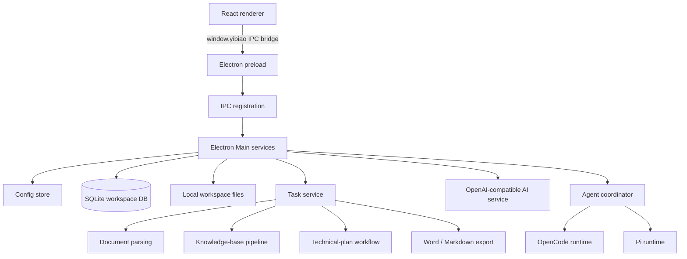

# OpenBidKit Source Architecture Study

> Scope: source-level study of `E:\my_idea_cc\OpenBidKit_Yibiao` at commit `b387b42`.
>
> This note is for architecture learning and product comparison. OpenBidKit is AGPL-3.0; its code must not be copied into BidPilot without a separate licensing decision.

## Executive summary

OpenBidKit is a local-first Electron vertical application for bid-document production. It is not a multi-tenant Web SaaS, and it is not built around a generic chat agent. Its strongest architectural idea is a controlled document-production pipeline:

- SQLite and workspace files are the local source of truth.
- Electron Main owns parsing, AI calls, persistence, long-running jobs, export, and agent runtimes.
- The renderer is an IPC client and visual workflow shell, not a business-state owner.
- Most work is deterministic orchestration around structured LLM calls, validators, and durable task snapshots.
- OpenCode/Pi are optional bounded repair and planning executors, not the product's central control plane.

This is a useful pattern for BidPilot's portfolio closure: retain a PostgreSQL-backed control plane and LangGraph workflow, but borrow the separation between durable business truth, structured intermediate artifacts, and a bounded harness.

## System map

### Code boundaries

| Boundary | Primary implementation | Observation |
| --- | --- | --- |
| Renderer | `client/src/` | React/Vite UI, typed bridge only. |
| Electron boundary | `electron/preload.cjs` | Exposes `window.yibiao`; renderer does not use Node APIs directly. |
| Composition root | `electron/ipc/index.cjs` | Constructs stores/services and registers IPC. |
| Business services | `electron/services/*.cjs` | Parsing, AI, tasks, knowledge base, export, agent coordinator. |
| Durable local data | `sqliteDatabase.cjs` + workspace files | SQLite owns structured state; large Markdown/assets remain files. |
| Analytics | `analytics/` | Separate Cloudflare Workers-based telemetry service. |

Sources: `client/开发说明.md`, `client/electron/ipc/index.cjs`, `client/electron/preload.cjs`.

## Business truth and persistence

The project explicitly keeps authoritative state outside prompts and renderer memory:

- Configuration: `userData/user_config.json`.
- Workspace database: `userData/workspace/yibiao.sqlite`.
- Large Markdown, uploaded documents, and image assets: workspace files; SQLite stores paths, hashes, counters, and lifecycle state.
- Technical-plan output source of truth: persisted outline nodes and content sections, rather than transient model messages.

`sqliteDatabase.cjs` defines separate tables for:

- Technical plan metadata, tasks, bid analysis items, reference docs, outline nodes, content sections/plans, global facts.
- Duplicate-check input, tasks, analysis sections, content/image duplication results.
- Rejection-check documents, extraction, results, and risk/typo/logic findings.
- Knowledge folders/documents/blocks/candidate items/final items/item-block mappings/reports/checkpoints/batches.

This is one of the strongest parts of the design: each feature has inspectable intermediate artifacts and can recover from a UI reload or task interruption.

## Technical-plan workflow

The user-facing flow is a staged production pipeline, not an unconstrained autonomous agent:

Implementation notes:

- `taskService.cjs` dispatches named job types, creates task snapshots, owns pause/resume, and binds an AI queue scope to each long-running task.
- `technicalPlanStore.cjs` persists workflow kind, step state, task status, outline, global facts, content plans, and section content.
- `bidAnalysisTask.cjs`, `outlineGenerationTask.cjs`, `globalFactsTask.cjs`, and `contentGenerationTask.cjs` are independent task handlers.
- The content task has explicit stages for section planning, generation, original-plan coverage audit/repair, consistency audit/repair, word-count adjustment, and illustration planning. It persists safe checkpoints rather than relying on an in-memory chain-of-thought.

The practical lesson is not the very long `contentGenerationTask.cjs` file itself. The lesson is that a valuable domain workflow has named, inspectable business stages and durable artifacts between stages.

## Knowledge-base design

OpenBidKit intentionally does not use conventional embedding retrieval as its primary path. It models a document knowledge base as a set of structured, source-backed knowledge cards.

Relevant data model:

- `knowledge_documents`: source path, Markdown path/hash, status/progress, counters.
- `knowledge_blocks`: heading path, content, ordering, noise-filter status/reason.
- `knowledge_candidate_items`: title and summary for proposed reusable topics.
- `knowledge_items`: final title, usage summary (`resume`), full reconstructed content.
- `knowledge_item_blocks`: many-to-many provenance mapping from card to source blocks.
- `knowledge_document_steps` and `knowledge_match_batches`: resumable processing checkpoints.
- `knowledge_reports` and `knowledge_discarded_groups`: coverage and discarded-material diagnostics.

Generation uses a two-phase context policy:

1. The planning request receives only the compact card ID/title/summary list and selects `knowledge.item_ids`.
2. The generation request receives only the full text for those selected IDs.

That is closer to skill selection than vector top-k retrieval. The author's own design note calls it "非 RAG" and describes the same inspiration explicitly.

Strengths:

- Provenance is explicit and human-inspectable.
- The model cannot cite a card that was never selected.
- Coverage/recovery handles unassigned source blocks.
- It controls context size without blindly embedding every chunk.

Limits:

- In the core source path reviewed, there is no embedding index, hybrid lexical retrieval, reranker, or cross-document semantic search.
- Ingestion costs multiple LLM passes and must be rerun when source structure changes.
- It is document-centric, not an entity/relation graph, user-profile memory system, or multi-tenant organizational knowledge system.

Sources: `electron/services/knowledgeBaseService.cjs`, `knowledgeBaseStore.cjs`, `sqliteDatabase.cjs`, `contentGenerationTask.cjs`, and `文章/新系列一：关于AI知识库的一点拙见，非RAG.md`.

## Agent harness

### Runtime coordinator

`agentService.cjs` is a small coordinator with a global FIFO queue. It:

- Resolves the selected runtime through `agentRuntimeRegistry.cjs`.
- Queues one runtime task at a time across OpenCode and Pi.
- Normalizes status, diagnostics, run results, retry summaries, and self-check reports.
- Emits status to the renderer and archives task workspaces after execution.

It is a harness adapter layer, not a planner with persistent conversational memory.

### Pi implementation

`piSessionFactory.cjs` dynamically imports `@earendil-works/pi-coding-agent` and `@earendil-works/pi-ai`.

- It creates in-memory credentials, model registry, settings, and session manager.
- The configured text model is exposed to Pi through a localhost OpenAI-compatible proxy.
- The session receives a temporary workspace, a generated `AGENTS.md`, and tools `read`, `bash`, `edit`, `write`, `find`, and `ls`.
- External Pi context files, extensions, skills, prompt templates, themes, telemetry, and external model-network discovery are disabled.
- `piRuntimeService.cjs` turns Pi tool events into product status events, collects diffs, validates output, archives workspace output, and records diagnostics.

### OpenCode implementation

The alternate runtime starts an OpenCode sidecar and provides its own proxy/config/environment. It additionally validates configured worktree, HOME, config/state directories, skills roots, and `external_directory=deny` through `opencodeIsolationService.cjs`.

### Important limitation

This is logical/workspace isolation, not a container or OS-level sandbox. The Pi runtime explicitly creates a shell-backed `bash` tool. Its instruction file says "only read/write the current workspace" and "do not access the network", but the source does not show a VM, container, Windows job-object restriction, or kernel-level filesystem policy. Treat it as a strong product guardrail, not a security boundary against a malicious prompt or compromised model.

### Where the harness is actually used

The project does not route all business work through a generic agent. `agentService.runTask()` appears in:

- Outline autonomous repair, old-outline gap completion, and outline leaf-count adjustment.
- Original-plan coverage repair.
- Whole-document consistency repair.
- Some content/illustration planning tasks.

The normal knowledge-base ingestion and most structured generation use direct, validated LLM calls instead. This is a sound domain choice: use the harness where iterative file work is useful; use deterministic task handlers for high-value, strongly typed production stages.

## Quality and operational design

Good engineering choices:

- Separate text/image request queues with configured concurrency limits and retry handling.
- JSON extraction/repair path for structured model outputs.
- Pause scopes cancel queued requests while allowing in-flight calls to resolve safely.
- Validation callbacks for agent output before business state is merged.
- Workspace archival and self-check reports for agent diagnostics.
- Runtime migration for SQLite schemas and a documented recovery policy.

Gaps visible in the current source tree:

- `client/package.json` exposes build/package/smoke scripts but no unit/integration test script.
- No conventional `*.test.*`/`*.spec.*` files were found in the clone.
- The long content-generation orchestrator is feature-rich but very large, making it harder to test and reason about than a smaller graph of explicit node contracts.
- Local-first architecture has no visible organization, tenancy, RBAC, collaboration, server-side audit, or enterprise key-governance layer.

These are not criticisms of the intended product category; they define its boundary: a powerful single-user desktop production tool, not an enterprise SaaS control plane.

## What BidPilot should learn, and what it should not copy

### Adopt as principles

1. Persist business truth and intermediate artifacts outside agent memory.
2. Turn documents into source-backed knowledge cards, not anonymous chunks alone.
3. Make generation first select evidence/cards, then inject selected content.
4. Persist stage state, progress, failures, and safe resume points.
5. Keep agent write capability bounded to explicit artifacts and validate before business-state mutation.

### Keep different in BidPilot

1. Use PostgreSQL/pgvector plus hybrid retrieval and reranking where it solves a real query problem; do not replace all retrieval with either vectors or card selection.
2. Use LangGraph for durable, inspectable workflow orchestration with typed state and human approval.
3. Use a Pi-inspired Python harness only for bounded interactive operator tasks, with explicit tool policy and approval records.
4. Preserve project/org/user permissions, audit logs, quotas, and source citations in the server-side control plane.
5. Do not add a knowledge graph or "LLM Wiki" visualization until project-scoped ingestion, retrieval evaluation, and evidence-backed drafting are proven.

## Suggested reading order

1. `README.md` and `client/开发说明.md`: product and architectural boundaries.
2. `client/electron/ipc/index.cjs`: composition root.
3. `client/electron/services/sqliteDatabase.cjs`: durable data model.
4. `client/electron/services/taskService.cjs`: task lifecycle.
5. `client/electron/services/knowledgeBaseService.cjs`: card ingestion pipeline.
6. `client/electron/services/contentGenerationTask.cjs`: planning, generation, audit, and recovery.
7. `client/electron/services/agentService.cjs` and `services/pi/piSessionFactory.cjs`: harness adapter design.
8. `client/electron/services/opencode/opencodeIsolationService.cjs`: logical isolation checks.

## Evidence pointers

- Repository: <https://github.com/FB208/OpenBidKit_Yibiao>
- Knowledge-base rationale: `文章/新系列一：关于AI知识库的一点拙见，非RAG.md`
- Client architecture: `client/开发说明.md`
- Current clone: `E:\my_idea_cc\OpenBidKit_Yibiao` at `b387b42`
