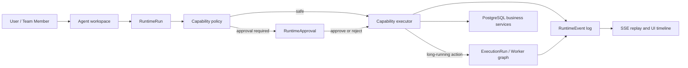
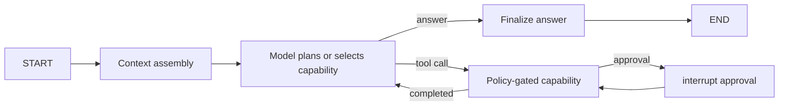

# BidPilot Unified Runtime v1 Design

- Status: proposed for implementation
- Date: 2026-07-14
- Depends on: `2026-07-14-bidpilot-product-agent-refoundation-v2-design.md`

## Goal

Replace the current split assistant and workflow control paths with one product-owned runtime contract. The contract must make an Assistant turn, a tool action, an approval, and a long-running workflow observable, authorized, resumable, and auditable in the same way without making LangGraph the source of business truth.

The user experience is simple: the Agent proposes and performs platform work, shows concise chronological progress, pauses only when approval is required, and can reconnect to an in-progress task. The implementation remains bounded to BidPilot capabilities; it is not an arbitrary code-execution agent.

## Current Problems

The current code has useful components but they do not share one reliable contract:

1. The Assistant has a deterministic intent/tool path and a LangGraph ReAct path with different confirmation, audit, and conversation behavior.
2. Capability metadata and tool implementations are duplicated between `app/assistant/tools.py` and `app/agent/tools.py`.
3. Workflow progress is inferred by querying LangGraph checkpoint tables, coupling the frontend to internal checkpointer storage.
4. `ExecutionRun`, `AssistantActionAudit`, `AssistantApproval`, chat task state, usage events, and workflow state describe overlapping work without a shared identifier or event sequence.
5. Tool output shapes are created for model convenience, then translated ad hoc for the UI. This is why raw or generic output has repeatedly leaked into product surfaces.
6. A retry or resumed node can re-run side effects unless the business action has an explicit idempotency key independent of the graph checkpoint.

## Decision

Introduce a product-owned `RuntimeRun` and append-only `RuntimeEvent` stream. Keep existing `ExecutionRun` as the domain record for a specific background workflow, and link it to a generic runtime run instead of overloading it with chat-only fields.

The runtime becomes the stable boundary. LangGraph, deterministic local routing, Celery, and a future engine are adapters behind that boundary. PostgreSQL stores the authoritative lifecycle, policy outcome, approval decision, action result summary, and public event sequence. LangGraph checkpoints remain execution recovery state only.

## Scope

### In scope

- A typed shared runtime contract in `packages/contracts`.
- Durable run, event, action, and approval records in PostgreSQL.
- One capability registry used by both Assistant and workflow-facing tools.
- One policy evaluator for approval mode, risk, authorization, resource scope, cost category, and idempotency rules.
- An explicit, bounded LangGraph operator graph for the Assistant.
- A deterministic adapter for tests and local no-provider operation that passes the same contract tests.
- A workflow bridge that records real worker node progress through the same event store.
- Replayable SSE events, cancellation requests, retry eligibility, and user-facing failure envelopes.

### Out of scope

- Arbitrary network, browser, local filesystem, shell, or MCP tool access.
- Free-form multi-agent debate or a generic agent builder.
- Durable long-term memory or LLM Wiki writes; those are a later governed-memory phase.
- Replacing the existing Bid Readiness compiler or response workflow graph topology in this phase.
- Token-accurate provider billing reconciliation; the runtime carries correlation fields now and the cost ledger phase settles usage later.

## Product Model

The runtime never writes business state directly. A capability executor calls existing project, document, requirement, drafting, review, or export service commands. Those domain services remain the only place that mutates their domain records.

## Runtime Contract

Every operation has a `RuntimeContext` and a `RuntimeRun`.

### RuntimeContext

Required fields:

- `run_id`, `trace_id`, and optional `parent_run_id`;
- actor `user_id`, `org_id`, role, and effective capabilities;
- optional `project_id`, `conversation_id`, and linked `execution_run_id`;
- engine name and version;
- selected provider config, model, and reasoning effort metadata;
- approval mode and immutable policy snapshot;
- sandbox scope: allowed project/resource identifiers and network policy;
- idempotency key and request correlation id.

Context is constructed server-side. A browser may request an approval mode or a project context, but cannot supply effective capabilities, an organization id, a provider secret, or a policy decision.

### RuntimeRun

`RuntimeRun` represents one user-visible unit of work. `kind` begins with:

- `assistant_turn`: one Assistant request and its bounded tool loop;
- `workflow_bridge`: a user-visible wrapper around a linked `ExecutionRun`;
- `system_recovery`: a server-initiated retry/recovery action.

It records `queued`, `running`, `awaiting_approval`, `succeeded`, `failed`, `cancel_requested`, `cancelled`, or `expired`. It has a unique organization-scoped idempotency key when a caller supplies one. It may have no project, because a user can ask an Agent to create a project or ask an organization-level question.

### RuntimeEvent

`RuntimeEvent` is append-only, sequenced per run, redacted before storage, and replayable. It is the only event source used by product UI. LangGraph checkpoint tables are never queried by the web API to invent product progress.

Initial event types:

| Type | Meaning | Persisted |
|---|---|---|
| `run.started` | Runtime accepted the request | yes |
| `plan.proposed` | Short operational plan, never hidden reasoning | yes |
| `capability.started` | A user-facing capability began | yes |
| `capability.progressed` | A bounded progress update | yes |
| `capability.succeeded` | Capability completed with public summary | yes |
| `capability.failed` | Capability failed with safe error envelope | yes |
| `approval.requested` | A policy decision paused work | yes |
| `approval.resolved` | Approval was approved, edited, rejected, or expired | yes |
| `workflow.linked` | A durable workflow run was created | yes |
| `message.delta` | Transient response token | no, streamed only |
| `message.completed` | Final user-facing answer | yes |
| `run.completed` / `run.failed` / `run.cancelled` | Terminal lifecycle transition | yes |

All stored events include a schema version, sequence number, ISO timestamp, safe public summary, and structured payload designed for a renderer. Raw provider responses, unrestricted tool output, prompts, chain-of-thought, and credentials are excluded.

### RuntimeAction and RuntimeApproval

A `RuntimeAction` records one capability invocation. It has a deterministic `action_key` derived from the runtime run and model tool-call id or server action id. A unique constraint on `(run_id, action_key)` prevents a resumed LangGraph node from creating duplicate business effects.

`RuntimeApproval` belongs to one action, stores only redacted arguments and the editable public request, expires after a policy-defined TTL, and can be resolved once. Approval resolution is authorized against the original organization, actor, and conversation/run context. A repeated approval request returns the original pending record, not a second action.

Existing `AssistantActionAudit` and `AssistantApproval` remain historical records during migration. New requests use generic runtime records. A compatibility projection can show legacy and new records in one audit UI until data-retention windows have passed.

## Capability Registry and Policy

One `CapabilityDefinition` replaces duplicated tool policy dictionaries. Each definition contains:

- stable name and localized user-facing labels;
- input and output Pydantic schemas;
- risk class: `read`, `navigate`, `low_risk_write`, `costing`, `destructive`;
- required product capability and resource resolver;
- approval behavior for each approval mode;
- idempotency strategy;
- audit event name and usage category;
- renderer metadata, such as icon and summary formatter;
- executor function that delegates to an existing domain service.

The policy evaluator runs before every executor call. It resolves authorization and resource scope first, then decides `allow`, `require_approval`, or `deny`. No model prompt, frontend selector, or LangGraph tool wrapper can bypass it.

Tool execution may return a structured domain result, but only the registry's formatter turns it into a public event. This removes raw `search_projects`, ORM objects, provider payloads, and opaque IDs from the product UI.

## Assistant Operator Graph

The Assistant uses an explicit bounded LangGraph graph, not the old prebuilt ReAct wrapper. The graph has four stages:

- The graph carries a maximum capability-call count and stops with a safe failure when the limit is exceeded.
- The policy-gated capability node persists an idempotent action before any side effect.
- It emits `RuntimeEvent` records through the product event publisher and LangGraph custom stream events.
- `interrupt()` is used only at an approval boundary. Its payload is JSON-serializable and contains no secret or hidden reasoning. Resume uses `Command(resume=...)` with the same `thread_id` as the runtime run.
- Nodes are idempotent because LangGraph restarts a node from the beginning after an interrupt or recovery.

The deterministic adapter accepts the same context, uses the same registry and policy evaluator, and emits the same contract events. It is only a model-selection adapter, not a separate business execution path.

## Workflow Bridge

The existing response workflow remains a separate long-running graph managed by Celery and its own `ExecutionRun`. When an Agent starts it, the capability creates both records in one domain transaction:

1. create the domain `ExecutionRun`;
2. create or update a linked `RuntimeRun(kind=workflow_bridge)`;
3. append `workflow.linked` to the parent Assistant run;
4. dispatch the worker using the domain run id as its checkpoint thread id.

Worker graph nodes call a small shared event-publisher adapter at node start, progress, completion, approval pause, and terminal result. The API streams these stored events. It does not inspect `checkpoints` or `checkpoint_writes` as a business event source.

The worker continues using Postgres-backed LangGraph checkpointing. In production, checkpointer initialization failure is an explicit run failure; it must not silently fall back to memory. In-memory checkpointing remains an explicit test/local mode only.

## Streaming and Reconnect

`GET /runtime/runs/{run_id}/events?after_sequence=N` returns replayable events and then follows live events when supported. The Assistant SSE route emits the same events in its compatibility envelope during transition. A client reconnects with its highest processed sequence and never needs to infer status from UI state.

The frontend renders action status before prose completion, groups only completed adjacent actions, and lets users expand safe public summaries. It does not render raw JSON. A workflow canvas subscribes to the same run event feed and uses real node statuses.

## Failure, Cancel, Retry, and Recovery

- Every executor gets an idempotency key before side effects.
- A policy or permission denial is terminal for that action and does not invoke a domain command.
- A provider failure records a safe classified error and a retry eligibility reason, without provider secrets or raw stack traces.
- Cancel requests are durable. The worker checks at node boundaries and stops before the next side effect; already committed domain effects are reported, never hidden.
- Retry creates a child runtime run with `parent_run_id`, rather than overwriting the original history.
- Approval expiration produces `approval.resolved(status=expired)` and a terminal run event. Replaying an expired approval is rejected.

## Rollout

1. Add contract models, migrations, event publisher, and contract tests without changing public behavior.
2. Move capability metadata and direct deterministic execution behind the registry/policy adapter.
3. Introduce the explicit operator graph behind a feature flag and verify deterministic parity.
4. Make the new operator runtime the default only after event ordering, approval, authorization, idempotency, and resume tests pass.
5. Replace workflow checkpoint scraping with worker-published runtime events.
6. Retire legacy Assistant task state/audit writes after a compatibility read path and migration note are in place.

No destructive table rename is required in v1. The migration is additive and supports rollback by routing new traffic back to legacy behavior while preserving runtime evidence.

## Acceptance Criteria

- The same capability and policy decision produces the same result through deterministic and LangGraph adapters.
- A safe read emits ordered `run.started`, `capability.started`, `capability.succeeded`, `message.completed`, and terminal events.
- A costing or destructive action creates one pending approval; approval/reject/expiry creates no duplicate domain effect.
- Interrupted/resumed operation performs a domain mutation at most once for the same idempotency key.
- A workflow node's UI state comes from stored runtime events, not checkpoint table parsing.
- A non-member receives no project data or run event replay.
- Provider secrets and raw tool/provider payloads are absent from runtime events, audit rows, and SSE output.
- A worker/checkpointer failure is explicit and recoverable rather than silently changing persistence mode.

## Sources

- LangGraph persistence and `thread_id`: https://docs.langchain.com/oss/python/langgraph/add-memory
- LangGraph interrupts and `Command(resume=...)`: https://docs.langchain.com/oss/python/langgraph/interrupts
- LangGraph custom streaming and idempotent node design: https://docs.langchain.com/oss/python/langgraph/streaming
