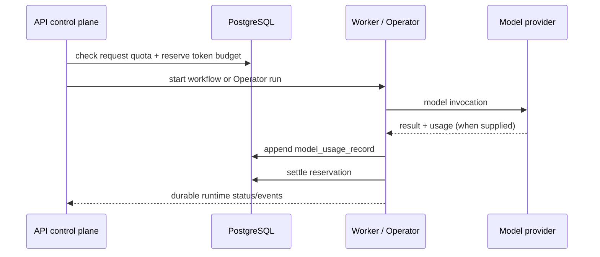

# Model Usage and Budget Governance Design

## Status

Accepted for implementation on 2026-07-18.

## Problem

BidPilot already records organization-scoped start counts for official workflow,
assistant, and indexing operations. That is enough for a small trial, but it is
not enough to operate a provider-owned API key safely at commercial scale:

- request counts do not explain which model consumed capacity;
- a successful provider response can contain real input/output token usage that
  the control plane currently drops;
- concurrent queued workflow calls can pass a simple aggregate check before
  any of them writes a result;
- a timeout can leave the platform unable to know whether the provider charged
  for a request;
- dollar values are unsafe to invent because providers, regions, cached tokens,
  and model revisions all have different prices.

The goal is a durable, provider-neutral usage ledger and optional hard budget
guard. It must protect the platform-owned key without weakening BYOK privacy or
making a false pricing promise to users.

## Non-goals for this phase

- billing users per token or reconciling invoices with every provider;
- guessing a model price from a model name;
- exposing prompts, completions, provider response bodies, or encrypted keys in
  usage records;
- replacing the existing request-count trial quota;
- cross-provider failover.

## Core principles

1. `UsageEvent` remains the append-only product event ledger for business
   actions such as "a workflow was started". Detailed model metering is stored
   separately so it can be queried and retained without overloading a generic
   event payload.
2. The control plane owns all usage and reservation records in PostgreSQL.
   LangGraph, Celery, LangChain, and provider SDKs only report measurements.
3. A provider-reported number is recorded as such. Missing or malformed usage
   is recorded as unavailable, never converted into an estimate.
4. Monetary cost is deliberately outside this phase. It can be introduced only
   after a reviewed provider/model pricing source and reconciliation policy
   exist; no numeric price or currency value is stored today.
5. Limits are server-side only. The browser can display remaining capacity but
   cannot choose, reserve, or override a budget.
6. The platform-owned provider key and a user's BYOK key have separate source
   accounting. BYOK still receives abuse/rate protection, but no platform cost
   is attributed to it.

## Data contract

### `model_usage_record`

One immutable row represents one completed model invocation that returned a
provider usage object. It contains:

- organization, actor, optional project, runtime run, and execution run;
- provider source (`official` or `byok`), protocol, optional retained provider
  configuration reference, and model name;
- workload (`workflow_requirement_extraction`, `workflow_draft`,
  `workflow_quality_review`, or `assistant_planning` in v1);
- provider-reported input, output, reasoning, cache-read, cache-write, and
  total token counts;
- measurement source and timestamp.

It never stores request prompts, response text, API keys, base URLs, raw
provider payloads, or any currency value.

### `organization_usage_budget`

One optional policy row per organization stores hard monthly token limits. It
has separate nullable caps for official and BYOK token totals. A `NULL` limit
means no additional token cap is configured; it does **not** remove existing
plan request quotas.

The initial phase exposes the read model and a service-level command. Editing
the budget is intentionally restricted to trusted organization billing/admin
control-plane paths in a later UI phase. Every effective change appends a
minimal organization audit row containing only the actor and before/after token
limits; empty or unchanged requests do not create policy evidence.

### `model_usage_reservation`

A reservation is created before a model invocation can execute. It is keyed to
the logical runtime/execution operation and holds conservative bounded prompt
plus output capacity while a call is in flight. The budget check uses:

`recorded monthly tokens + active reservations <= configured cap`.

Terminal behavior:

- immediately before provider I/O, a Worker changes its hold from `reserved`
  to `dispatched` and commits it; this is still active budget capacity;
- success: persist actual provider usage, then settle/release the reservation;
- deterministic configuration/validation failure: release it immediately;
- timeout/unavailability with no provider usage: mark it `uncertain` until a
  short expiry window. This is intentionally conservative because a provider
  may have processed a request even if the client did not receive a response;
- an expiry sweep releases stale reservations. A future operations surface can
  summarize expiry patterns without storing raw provider traffic.

The first implementation uses workflow run identifiers for every drafting
workflow model call and runtime run identifiers for the bounded Operator
planner. The API preflight hold is a generic `workflow_execution` reservation;
the first actual model node claims it immediately before network I/O. Every
later parsing, drafting, review, retry, or checkpoint-replay dispatch receives
a fresh internal reservation key. If a replay sees an older key still
`dispatched`, it marks that older request uncertain before the new request is
allowed to leave the Worker. The Operator reserves once per actual planner
invocation, commits that hold before network I/O, and then settles or marks
that specific invocation uncertain.

## Provider adapters

OpenAI-compatible responses are normalized from the documented `usage`
structure (`prompt_tokens`, `completion_tokens`, optional reasoning details).
Anthropic Messages responses are normalized from `usage` (`input_tokens`,
`output_tokens`, and optional cache token fields). A single Worker-owned
structured-text adapter serves requirement extraction and quality review across
both protocols; specialized drafting adapters use the same provider-selection
and per-dispatch accounting lifecycle. The normalizer tolerates missing
optional fields and records only non-negative integers.

The graph supervisor is deterministic control-plane code, not an LLM call.
Choosing a known graph edge from durable state has no semantic benefit from a
model and must not consume provider capacity or introduce a nondeterministic
route.

The bounded Operator sets a maximum assistant planner output through the
installed LangChain provider adapters. The workflow adapters likewise cap
OpenAI-compatible and Anthropic output. For current official Claude models
that reject legacy manual thinking budgets, the native adapter uses adaptive
thinking with the current effort control and omits non-default temperature.

No adapter logs an API key, a prompt, a completion, or a raw response while
processing metering.

## Execution flow

The existing provider reliability contract remains in force: typed failures are
shown to users as stable codes and recovery guidance, never as raw provider
diagnostics. A usage-write failure must not convert a successful document draft
into a failed user result; it is logged internally and exposed as an operations
gap, while the provider call remains auditable through its runtime/run records.

## Limits and commercial policy

- Starter official trial limits remain request-based and are enforced before a
  workflow or assistant invocation begins.
- A configured organization token cap is an additional hard guard. It is
  appropriate for pilots, platform-owned free capacity, and a compromised
  account containment policy.
- BYOK usage is recorded separately. A tenant may opt into a BYOK token cap to
  limit accidental automation, but the platform does not claim to know the
  tenant's external invoice.
- A price catalog, cost caps, and reconciliation are deferred. Until then the
  account UI reports token use and `cost: unavailable` rather than an invented
  dollar estimate.

## Read model

`GET /usage/quota` will be extended with a safe monthly model-usage summary:

- official/BYOK input, output, reasoning, and total tokens;
- active/uncertain reserved tokens;
- configured token limits and remaining capacity where meaningful;
- an explicit `cost: unavailable` state until a reviewed price catalog exists.

The account surface can use this summary for transparent trial and operational
messaging. It must not reveal provider configuration IDs or secret metadata.

## Acceptance criteria

1. Real OpenAI-compatible or Anthropic parsing, drafting, and review responses
   store normalized token values without raw payload data.
2. An Operator planner response can write the same safe usage record.
3. A configured official token budget rejects a new call before dispatch when
   actual usage plus active reservations would exceed it.
4. Success settles its own `dispatched` reservation; terminal configuration
   failure releases it; a timeout or checkpoint replay enters the conservative
   uncertain state without releasing an earlier attempt.
5. Existing request-count quotas still work for official providers and BYOK
   does not accidentally use the official quota.
6. API, Worker, and frontend tests cover the above without real provider calls.
7. All usage queries remain organization-scoped and membership-authorized.

## Deferred follow-ups

- reviewed provider/model price catalog and cost reconciliation;
- organization-owner budget editing UI and alert delivery;
- daily spend dashboards and anomaly alerts;
- provider contract probes and cross-provider fallback policy;
- live provider/VPS trace evidence and retained CI artifacts.
