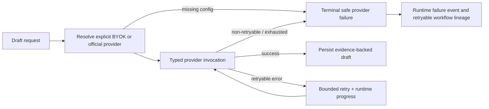

# BidPilot Provider Reliability and Failure Contract

- Status: Approved implementation plan
- Date: 2026-07-18
- Depends on: `2026-07-14-bidpilot-unified-runtime-v1-design.md`

## Problem

The response-workflow OpenAI-compatible and Anthropic adapters currently catch
every provider exception and return a synthetic fallback draft. The LangGraph
section node therefore records a successful draft even when the configured
provider timed out, rejected a key, rejected a model, or returned a server
failure. Its retry decorator never sees the failure.

The production Compose definition also does not force `USE_LANGGRAPH=true` for
the Worker, so a production deployment can silently use the legacy drafting
path instead of the governed graph and product runtime event stream.

This is unacceptable for a bid-response system: a generated-looking artifact
must never be mistaken for a verified provider result.

## Decision

### 1. Provider failures are typed, safe, and explicit

Worker adapters raise `ProviderInvocationError` rather than returning a fake
successful draft for a real provider failure. The exception contains only:

- a stable public error code;
- a user-safe message;
- whether a bounded retry is allowed.

It never contains an API key, Authorization header, raw prompt, response body,
or unrestricted endpoint text.

| Error code | Examples | Retryable |
|---|---|---:|
| `provider_not_configured` | no selected platform key in production | no |
| `provider_config_missing` | BYOK record was removed after dispatch | no |
| `provider_auth_failed` | 401/403 | no |
| `provider_model_unavailable` | 404 model/endpoint | no |
| `provider_request_invalid` | 400/422 | no |
| `provider_rate_limited` | 429 | yes |
| `provider_timeout` | connect/read/write/pool timeout | yes |
| `provider_unavailable` | connect error, 408, 409, 5xx | yes |
| `provider_response_invalid` | invalid JSON, missing usable text | yes |

### 2. Stub drafting is local-only and explicit in production

Local development and tests may use the deterministic structured stub when no
provider key is configured. Production rejects missing provider credentials
with `provider_not_configured` unless the deployment owner explicitly sets
`DOCPILOT_ALLOW_STUB_LLM=true`; production readiness must reject that override.

The stub is a development adapter, never a fallback for a failed real call.

### 3. No silent provider or billing fallback

When a caller selected a BYOK provider, a missing/deleted config fails the run.
It must not fall through to an official provider key, because that changes the
customer's intended cost source and can leak a request into a different
provider boundary. Cross-provider failover remains out of scope until it has
an explicit user/org policy, model compatibility declaration, cost reservation,
and audit UX.

### 4. Retry only transient provider failures

The section-drafter node uses at most three attempts with bounded exponential
backoff. It retries only a typed retryable provider error. Configuration,
authentication, model, and malformed-request errors are terminal immediately.

Each retry adds a redacted `capability.progressed` runtime event with attempt,
maximum attempts, and stable error code. A terminal provider failure carries
the same code in the graph state and in the final runtime failure envelope.

### 5. Production workflows always use the governed graph

Production Worker configuration and readiness checks require
`USE_LANGGRAPH=true`. The legacy drafting implementation remains available for
local compatibility only. It receives the same typed provider errors while it
exists, but is not an approved production engine.

## Flow

## Non-goals

- automatic cross-provider model fallback;
- retrying non-idempotent side effects;
- exposing raw provider response diagnostics to users;
- settling token-level cost reconciliation;
- changing Assistant model-selection behavior beyond shared error hygiene.

## Acceptance criteria

- a provider timeout or 429 produces no section version and no successful
  `draft_created` state until an actual provider response succeeds;
- 401/403/404/400 errors do not retry;
- a missing BYOK config after queue dispatch never uses the official key;
- runtime events show a safe retry progress entry and terminal error code;
- production readiness and Compose both require `USE_LANGGRAPH=true`;
- local no-key adapter tests still use a clearly marked stub;
- API/Worker regressions and production web build pass without a live provider.

## Implementation evidence

Implemented on 2026-07-18:

- the provider adapters raise typed safe errors instead of fabricating drafts;
- the LangGraph section drafter routes typed terminal failures to `END` before
  review or persistence;
- runtime events, drafting SSE, and the Assistant activity timeline preserve
  retry attempts and error codes without exposing raw diagnostics;
- Worker tests now require a dedicated `_test` database, matching API test
  isolation;
- local evidence: API `569 passed`, Worker `88 passed`, Web `25` files / `91`
  tests, TypeScript check, and production build passed.

Not yet evidenced: real provider contract probes, deployed runtime/SSE traces,
and external code-review findings. These remain controlled-pilot release gates.
