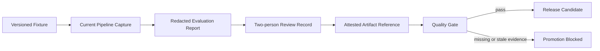

# Release Quality Evidence Provenance Design

## Status

Proposed for implementation on 2026-07-18.

## Problem

BidBench, RetrievalBench, and MemoryBench already calculate useful metrics and
the release gate checks their thresholds, fixture role, and Git revision. That
is necessary but insufficient for a commercial quality claim: a hand-authored
or stale JSON report can have valid metrics without proving it came from the
current Agent pipeline or received human review.

## Goals

1. Keep development fixtures easy to run locally.
2. Make release mode reject missing or weak evidence provenance.
3. Require one common release commit, a bounded report age, a real runtime
   capture source, two-person review metadata, and an external attestation or
   review reference.
4. Store only redacted identifiers and metadata. No prompts, customer text,
   provider payloads, keys, or reviewer personal data belong in a report.
5. Preserve backwards compatibility for existing development reports while
   making them ineligible for release promotion.

## Non-Goals

- Cryptographically verify a CI platform or human signature in this repository.
  The initial `attestation_ref` is an auditable pointer; the artifact store or
  CI platform remains the authority.
- Claim that a synthetic fixture predicts customer outcomes.
- Automatically approve benchmark annotations or quality reports with an LLM.

## Shared Provenance Contract

Every report type may carry an optional `EvaluationEvidenceProvenance`:

| Field | Meaning |
|---|---|
| `capture_kind` | `current_pipeline`, `reviewed_snapshot`, or `control_fixture` |
| `review_level` | `unreviewed`, `single_reviewer`, or `two_person_review` |
| `attestation_ref` | Redacted CI run, artifact, or review record identifier |
| `evaluator_version` | Versioned extraction/retrieval/memory evaluation harness |
| `capture_id` | Stable opaque run identifier linking the three reports |

The contract deliberately contains no secret or customer material.

## Release Policy

`QualityGatePolicy` gains explicit requirements:

1. Allow only configured capture kinds, defaulting to `current_pipeline` and
   `reviewed_snapshot`.
2. Require `two_person_review` for `regression` and `hidden` reports.
3. Require the same `capture_id` and a non-empty attestation reference.
4. Reject reports older than a non-configurable maximum of seven days.
5. Require model/prompt/provider metadata where that metric path invokes a
   model or retrieval profile.

Development mode records threshold failures but does not enforce release
provenance. Release mode refuses missing provenance rather than inferring it.
The release policy can tighten metric thresholds and allowed capture sources,
but cannot weaken two-person review, attestation, capture linkage, or report
freshness below the platform baseline.

## Capture Flow

## Verification

- Unit tests cover acceptance of complete current-pipeline evidence.
- Unit tests reject control fixtures, single-review evidence, stale reports,
  missing attestations, and mismatched capture identifiers in release mode.
- Capture and scoring tests prove embedded redacted provenance survives from
  BidBench candidates and RetrievalBench/MemoryBench runs into release reports;
  omitted provenance remains development-only.
- Existing development benchmark tests continue to work without provenance.

## Rollout

1. Add the optional shared contract and release-only validation.
2. Accept the contract in saved candidate/run JSON so capture remains portable
   across local and CI runners.
3. Document an operator template for producing redacted provenance metadata.
4. Do not change the release checklist from "evidence required" to "ready"
   until a reviewed regression/hidden run is retained outside the repository.
