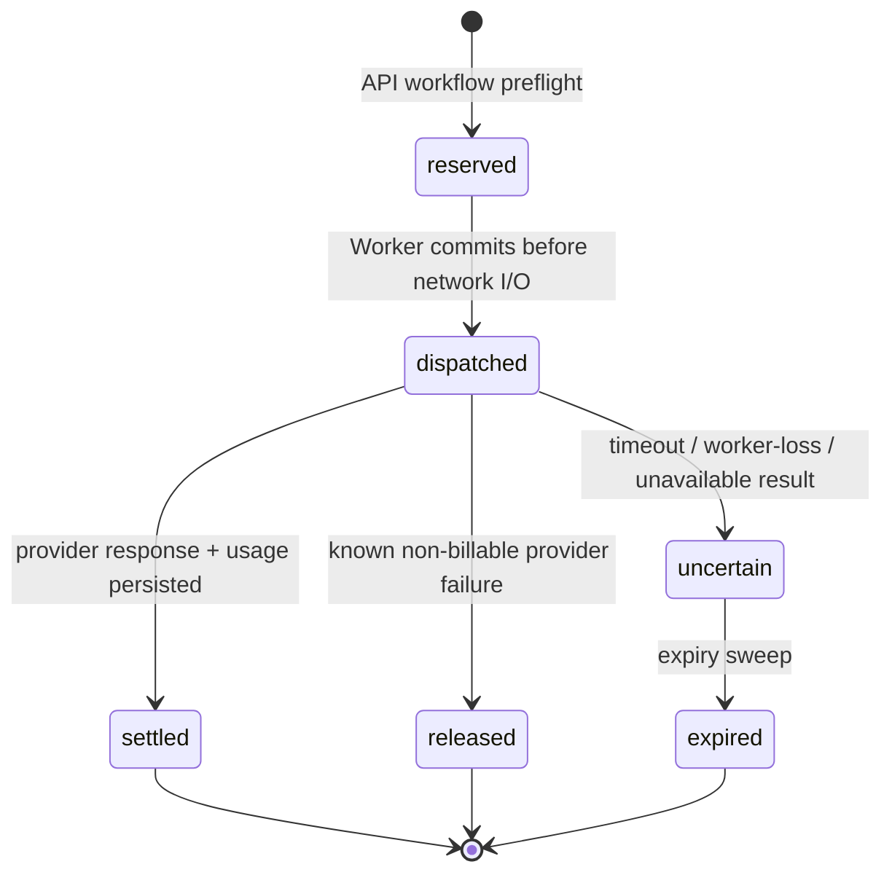

# Workflow Model Invocation Governance Design

## Status

Accepted for implementation on 2026-07-19.

## Problem

The BidPilot LangGraph workflow previously contained four model invocation
paths:

1. requirement extraction;
2. document drafting;
3. quality review;
4. supervisor routing.

Only drafting flowed through typed provider adapters and the token ledger. The
other paths could bypass BYOK protocol handling, token reservations,
provider-reported usage records, bounded errors, and retry accounting. The
supervisor also asked a model to choose deterministic graph edges, adding cost
and nondeterminism without a business benefit.

LangGraph checkpoints occur at node boundaries. A resumed node starts from the
beginning, so a provider call made before a checkpoint can be repeated unless
the call boundary is durable and conservative. See the official
[LangGraph Graph API guidance](https://docs.langchain.com/oss/python/langgraph/graph-api)
and [interrupt idempotency guidance](https://docs.langchain.com/oss/python/langgraph/interrupts).

## Decisions

### 1. Deterministic graph routing

The supervisor uses only durable workflow state to choose the next node. It is
not a model call and therefore cannot consume a provider key or choose an
invalid edge. Models remain responsible for bounded semantic tasks, not
control-flow decisions already expressible as code.

### 2. One structured provider adapter

Requirement extraction and quality review use one Worker-owned adapter for
OpenAI-compatible and Anthropic Messages protocols. The adapter:

- resolves either the authorized BYOK configuration or the official server
  configuration;
- bounds prompt and output size per workload;
- returns typed provider failures and normalized numeric usage only;
- never emits keys, prompts, completions, base URLs, or raw provider payloads
  into logs, events, or the usage ledger.

Drafting can keep its specialized evidence-writing adapter, but it uses the
same invocation lifecycle and provider-selection rules.

### 3. Durable per-dispatch lifecycle

Every actual provider request follows this lifecycle:

The API preflight hold is claimed by the first real model request in the
workflow. Every later request gets a fresh, internally generated reservation
key before network I/O. If a checkpoint recovery sees an earlier call still
`dispatched`, it marks that call uncertain and creates a new hold for the new
physical dispatch. A later success settles only its own key.

The `dispatched` status is an active reservation for budget purposes. It does
not hold a database transaction while the provider is processing the request.

### 4. Workload attribution

`model_usage_record` records the actual semantic workload for every response:

- `workflow_requirement_extraction`;
- `workflow_draft`;
- `workflow_quality_review`;
- `assistant_planning`.

The preflight reservation is a generic `workflow_execution` capacity hold. It
is intentionally separate from the eventual usage workload, because the first
provider call may be parsing, drafting, or review depending on available input
and checkpoint recovery.

### 5. Safe degradation

Requirement extraction and quality review retain deterministic fallbacks only
when the structured provider path fails or is unavailable. The fallback is
recorded as a degraded method in agent history and never represented as model
usage. Drafting remains a typed workflow failure when no real provider is
available outside explicitly permitted local stub mode.

## Acceptance criteria

1. No LangGraph workflow node directly invokes a provider SDK or raw HTTP
   model endpoint outside approved adapters.
2. Supervisor routing does not call an LLM.
3. Parsing, drafting, and review each have a bounded provider input/output
   contract and protocol-correct OpenAI-compatible/Anthropic path.
4. Every real provider dispatch has a committed reservation before I/O when a
   token cap is configured.
5. A checkpoint replay cannot settle or release an earlier uncertain call.
6. Usage records use the actual workload and only provider-reported numeric
   counters.
7. Tests cover first dispatch, replay/retry dispatch, budget exhaustion,
   OpenAI-compatible and Anthropic response normalization, and deterministic
   fallbacks.

## Non-goals

- provider price reconciliation or user-visible currency estimates;
- automatic cross-provider failover;
- arbitrary LLM-directed workflow routing;
- moving the full workflow into LangGraph Functional API in this phase.
