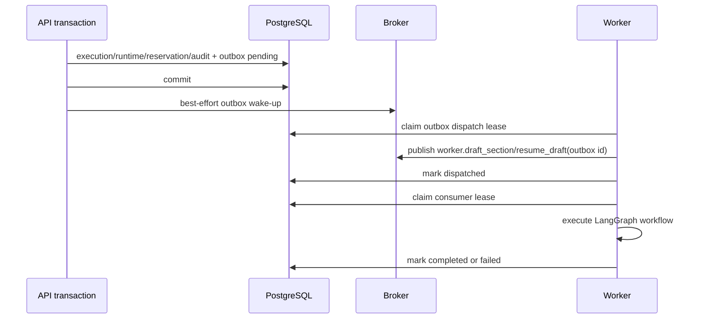

# Workflow Task Outbox Design

## Status

Accepted for implementation on 2026-07-19.

## Problem

Workflow commands previously created execution state, budget reservations, and
audit evidence in a PostgreSQL transaction but published the Celery task before
that transaction committed. A fast Worker could receive the task before the
run or reservation was visible. Conversely, committing before a direct broker
publish leaves a crash window in which a durable queued run is never sent.

For a provider-billed, long-running Agent workflow, neither failure mode is
acceptable.

## Scope

This phase covers tasks that start a billable drafting workflow:

- `worker.draft_section` from normal draft, redraft, and explicit retry;
- `worker.resume_draft` after a human approval or rejection;
- their durable `ExecutionRun` / `RuntimeRun` records.

Other background work remains unchanged until its ownership and retry
semantics are reviewed separately.

## Design

### Transactional producer record

`task_outbox_event` is written in the same API transaction as the workflow
run, runtime bridge, usage event, reservation attachment, and audit event. It
contains only:

- trusted internal task name;
- JSON-safe task arguments and keyword arguments;
- a unique logical deduplication key;
- organization/project/execution/runtime references;
- dispatch and delivery status, attempts, leases, and safe error code.

It never stores API keys, raw provider requests, provider responses, or browser
input outside data already held by the durable workflow command.

The producer first reads an existing logical event under a row lock. If two
transactions race past that read, the unique-key insert is contained in a
savepoint; the loser re-reads and returns the committed event without rolling
back the surrounding workflow transaction.

### Post-commit delivery

After the transaction commits, the API makes a best-effort request to
`worker.dispatch_task_outbox_event`. Failure to publish this small wake-up task
does not lose the command because the outbox row remains `pending`.

Worker Beat scans pending and expired-lease rows. The dispatcher first claims a
short database lease, then sends the actual task with the outbox ID as its
Celery task ID and envelope keyword. It marks the row `dispatched` only after
the broker accepts the send request. The dispatcher loads Celery at publish
time rather than module import time, so Celery task autodiscovery cannot form a
cycle with the Outbox consumer module.

Human approvals use a per-`ExecutionRun` monotonic `resume_sequence` stored in
the durable workflow input. The resume endpoint accepts only
`awaiting_human` runs, transitions it to `running` in the same transaction, and
uses the sequence in its deduplication key. A later graph interruption receives
a new sequence; a duplicate HTTP submission after the first commit is rejected
because the run is no longer awaiting approval.

### Consumer lease and at-least-once safety

The workflow task atomically claims its outbox row before execution. A duplicate
message with an active consumer lease exits without re-running the workflow.
If the Worker dies, the lease expires and the dispatcher may redeliver. This is
intentionally at-least-once delivery: the governed model-call lifecycle records
the prior `dispatched` request as uncertain before a replay issues another
provider call.

## Status transitions

`pending -> dispatching -> dispatched -> processing -> completed`

Leased `dispatching`, `dispatched`, or `processing` rows can be reclaimed only
after lease expiry. A deterministic broker publish failure returns the row to
`pending` with a safe error code and backoff. A workflow exception becomes
`failed`; user-driven workflow retry creates a new execution run and new outbox
event rather than mutating a failed event.

## Acceptance criteria

1. The API never directly publishes a billable drafting or resume task before
   the owning transaction commits.
2. A committed workflow command has a unique outbox record even if the wake-up
   publish fails.
3. A Worker Beat recovery can dispatch pending/expired workflow outbox events.
4. A duplicate broker delivery does not concurrently execute a workflow with
   an active consumer lease.
5. The event payload and logs contain no provider secret or raw provider
   payload.
6. API/Worker tests cover enqueue, post-commit wake-up, dispatch recovery,
   duplicate consumer delivery, and completion/failure transitions.

## Verified implementation evidence

- Isolated SQLite API checks verify a normal draft writes an Outbox event and
  committed execution row before the wake-up hook runs; a human-resume event is
  sequenced and cannot be submitted twice for the same pause.
- Isolated SQLite Worker checks verify dispatch payload injection, Beat recovery,
  active consumer-lease duplicate suppression, and terminal failure recording.
- API/Worker Ruff, compile checks, and Alembic head validation pass for the
  touched paths. Full PostgreSQL regression also passes on a freshly migrated
  local `docpilot_test` database: API `583 passed`, Worker `110 passed`.
  The core release rehearsal passed without deployment. Authenticated browser,
  real-provider, and VPS evidence remain separate promotion gates.

## Non-goals

- exactly-once external provider invocation (not achievable without provider
  idempotency support);
- replacing every existing Celery producer in this phase;
- a user-facing outbox dashboard before operational evidence exists.
