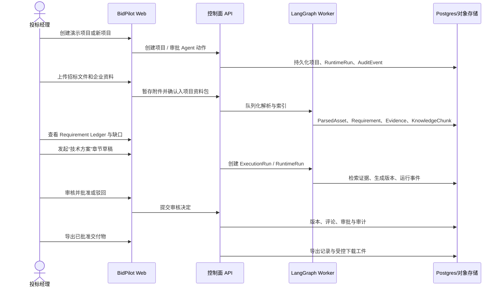

# BidPilot 受控试点与作品集收口规格

- 日期：2026-07-22
- 状态：已部署；源代码、迁移、依赖就绪检查与 HTTPS 冒烟验证均已完成
- 适用范围：BidPilot 首个场景包
- 替代关系：本规格不废弃既有架构设计；它把已有设计收敛为一个可验证、可部署、可展示的交付目标。

## 1. 决策摘要

BidPilot 的本次目标不是继续堆叠“看起来像企业平台”的功能，也不是宣称已经具备商业化大规模交付能力。

本次交付应是一个可公开访问的 **受控试点（controlled pilot）与作品集版本**：它能让一位用户在真实投标资料场景中，从创建项目到上传资料、抽取要求、证据检索、起草、人工审核、导出，完整走通一次，并且可以解释每个关键动作的权限、证据和审计来源。

产品定位固定为：

> BidPilot 是面向投标响应团队的 AI 合规与响应执行工作台。它让资料、要求、证据、草稿、审核和交付物处于同一个受控流程，而不是把一次模型回答当作最终成果。

本项目不以“比 OpenBidKit 功能更多”为目标。OpenBidKit 的本地文档生产流水线是有价值的参照；BidPilot 要展示的是服务端控制面、可恢复工作流、证据治理和受控 Agent 的全栈工程能力。

## 2. 发布边界

### 2.1 本次可以对外陈述的能力

- 项目化投标资料工作区。
- 私有资料上传、解析、索引和项目范围隔离。
- Requirement Ledger：要求、证据、缺口和就绪度。
- 带来源定位或明确缺证标记的章节起草。
- 审核评论、批准、驳回和可追溯重跑。
- 受控 Agent：以注册能力操作平台，关键动作必须经过政策与审批。
- 可恢复的 LangGraph 工作流、运行事件与审计记录。
- 已批准内容的导出与受控下载。

### 2.2 本次不得宣称的能力

- 已完成商业级多租户 SLA、灾备、7x24 运维或支付闭环。
- 已通过真实客户数据、法务、行业合规或大规模负载验证。
- 任意文档都能零人工生成可直接提交的投标文件。
- 任意模型、任意第三方 API 都可无差异接入。
- 通用代码执行 Agent、真实 OS 沙箱，或自动化外部通信。

公网版本的正式名称为“受控试点 / Portfolio Release”，不是“企业生产版”。

## 3. 用户与黄金路径

### 3.1 目标用户

| 角色 | 主要目标 | 本次权限 |
| --- | --- | --- |
| 投标经理 | 建立项目、分配资料、判断就绪度 | 项目创建、资料上传、发起流程、查看审核 |
| 方案工程师 | 基于要求与已有材料起草章节 | 查看授权资料、发起章节草稿/重跑 |
| 审核人 | 判断内容是否可用、是否有证据支撑 | 评论、批准、驳回 |
| 工作区管理员 | 管理成员与模型配置 | 组织、成员、BYOK 与配额控制 |

### 3.2 单一黄金演示路径



该路径必须同时支持：

1. 内置无模型 Demo Workspace，用于首次访问和稳定演示。
2. 真实小型资料包路径，用于证明解析、检索、起草、审核、导出不是静态假数据。

## 4. 系统形态

### 4.1 四层边界

| 层 | 职责 | 绝不承担 |
| --- | --- | --- |
| Control Plane | 项目、资料、要求、证据、版本、审核、导出、审计、配额 | 将业务真相藏在 Prompt 或 LangGraph state 中 |
| Workflow Plane | 解析、索引、检索、起草、质量校验、恢复 | 绕过审批或直接定义最终业务状态 |
| Harness Plane | 解释用户意图、选择已注册能力、展示进度、请求审批 | 任意 shell、文件系统、网络、账单或管理员操作 |
| Integration Plane | 模型、嵌入、重排、解析、存储、导出适配器 | 把供应商协议泄漏到产品领域模型 |

PostgreSQL 是所有业务事实的唯一来源；LangGraph checkpoint 只负责执行恢复。

### 4.2 Agent 与 Workflow 的分工

#### Harness Agent：Pi 范式，但不是 Pi Runtime 的照搬

Harness 使用 Pi 的工程思想：有界循环、显式工具注册、结构化事件、可取消任务、确定的停止条件和工作结果校验。

Web 产品中它由现有的受控 LangGraph Operator 实现：

```text
用户消息 -> 上下文装配 -> 意图/参数计划 -> Policy 判定
-> 必要时 interrupt 审批 -> 调用注册 capability -> RuntimeEvent
-> 结果摘要 -> 下一轮或完成
```

约束：

- 只可调用 Capability Registry 中的产品能力。
- 不提供 `bash`、任意 URL 请求、主机文件读写或数据库直连工具。
- 模型不能自行批准、绕过组织范围、改变配额、读取 BYOK 密钥或删除未明确指向的资源。
- 所有写操作携带幂等键、RuntimeAction、Policy 决定和 AuditEvent。

#### Workflow Agent：LangGraph

LangGraph 只负责长流程和状态机：

```text
准备输入 -> 解析/要求抽取 -> 检索与重排 -> 章节起草
-> 质量检查 -> 人工审批 -> 持久化交付物 -> 运行结束
```

每个节点都必须：

- 有明确输入/输出契约；
- 在业务副作用前后保持幂等；
- 通过 RuntimeEvent 暴露状态，不让前端读取 checkpoint 内表；
- 在暂停、取消、失败、重试时留下可解释的持久化状态。

### 4.3 知识、证据和记忆

本次不新增一个“炫酷 3D 知识图谱”表面。先保证以下四层不混淆：

| 层 | 用途 | 允许进入模型上下文的形态 |
| --- | --- | --- |
| Source / Parsed Asset | 原始文件与标准化文本 | 受长度限制的标记为不可信资料块 |
| KnowledgeChunk / Retrieval | 项目资料的可检索事实 | 混合召回、重排后的有限证据包 |
| Evidence | 要求或草稿可追溯的来源定位 | 引文、locator、置信/缺证状态 |
| Bid Wiki / Memory | 经治理的偏好、决策、程序与风险 | 授权、编译、预算受限的记忆摘要 |

检索策略固定为：范围过滤 -> 稠密/FTS/trigram 候选 -> RRF -> 可选重排 -> 引文校验。任何检索失败必须显式降级为“缺少证据”，不得伪造引用。

OpenBidKit 的“知识卡 + 原文块映射”理念可在未来用于知识编译层，但不是本次引入第二套存储模型的理由。

## 5. 本次交付功能清单

### 5.1 必须可用

| 编号 | 功能 | 验收结果 |
| --- | --- | --- |
| CP-01 | 项目与工作区 | 新用户可创建个人工作区项目，成员只能看到自己有权限的项目。 |
| CP-02 | 内置 Demo | 无供应商密钥也可创建演示项目并浏览要求、证据、章节、审核与审计。 |
| CP-03 | 资料治理 | 上传先进入私有暂存；复制进项目资料包前走授权和审计。 |
| CP-04 | 解析与索引 | 一个小型 DOCX/PDF/Markdown 资料包可产生可查看的 ParsedAsset、Requirement 和 Evidence。 |
| CP-05 | Requirement Ledger | 能查看要求来源、负责人/状态、缺口与项目就绪度。 |
| CP-06 | Evidence-backed Draft | 指定章节起草后生成版本，附证据链接或明确缺证标记。 |
| CP-07 | Review | 审核人可评论、批准或驳回；驳回后可带反馈重跑。 |
| CP-08 | Export | 仅允许导出批准内容；下载通过鉴权工件接口而不是裸对象存储 URL。 |
| CP-09 | Agent Operator | 能通过对话完成创建项目、查看就绪度、暂存附件、开始起草、提交审核、导出、删除项目等已登记能力。 |
| CP-10 | Approval / Audit | 高风险动作等待确认；每次动作、审批、运行、错误与导出都有可查看事件。 |
| CP-11 | Recovery | SSE 断开后可按 runtime event cursor 恢复；失败的工作流可形成独立重试尝试。 |

### 5.2 本次冻结，不再扩展

- 支付、Stripe 真实收款、套餐营销和价格页继续保持非演示核心。
- 邮件投递质量、域名信誉、完整 SSO/SCIM、企业管理员控制台。
- 任意第三方 provider 预设数量和界面美化。
- 3D 知识图谱、通用图工作流编辑器、Canvas 类功能。
- 新的 ReactBits 动效、Landing Page 重构、无关 UI 主题迭代。
- 通用网络/代码执行 Agent 与本机或 VPS 操作工具。

这些项目可以保留已有实现，但不作为本次发布验收项，也不在没有独立规格的情况下继续修改。

## 6. 实施策略

### 阶段 A：可复现基线与代码收敛

当前工作树存在大量未提交修改。第一步不是继续叠代码，而是建立可回退基线：

1. 秘密扫描，确认 `.env`、构建产物、下载文件、日志和数据库文件不进入 Git。
2. 以文件清单审计已有修改，按“核心代码、迁移、测试、文档、临时产物”分类。
3. 不使用 `git add .`、`reset --hard` 或批量回滚。
4. 将可解释的核心改动拆成小提交，创建 `codex/bidpilot-controlled-pilot-closeout` 分支。
5. 在该分支运行一次迁移、API/Worker/Web 基线验证，记录真实结果。

完成条件：有一个可构建、可测试、可回退的基线提交；任何未解释的脏文件都不会被带入发布。

### 阶段 B：黄金路径契约审计与缺口修复

按 CP-01 至 CP-11 从 API -> Worker -> Web 一条条验证。只修复阻塞路径的真实缺口：

- 数据库迁移遗漏、模型字段不一致、持久化事件缺失；
- API 鉴权、组织/项目范围、审批恢复或 SSE reconnect 错误；
- Worker 任务投递、LangGraph checkpoint、幂等和失败恢复错误；
- 前端将原始工具输出、异常堆栈或未授权状态暴露给用户的问题；
- 导出、下载、证据引用或审核状态无法闭环的问题。

每个修复必须先添加或调整最小回归测试，再改实现。

### 阶段 C：真实资料包验收

使用不含敏感信息的样例资料包执行一次真实端到端路径。资料包应包含：

- 一份小型招标需求/RFP；
- 一份企业能力/案例材料；
- 一份可形成至少 5 条要求的 Markdown 或 DOCX；
- 明确的预期证据定位与审核判断。

验收不以“文笔好”为唯一标准，而以：要求是否抽取、证据是否可定位、缺证是否诚实、审核是否可追溯、导出是否只取批准版本为准。

### 阶段 D：发布候选与公网受控试点

部署沿用既有约定：

```text
/app/bidpilot/
  repo/                 # GitHub 私有仓库 checkout
  .env                  # 只在服务器保存的秘密
  docker-compose.yml
  deploy.sh             # git pull + docker compose up -d --build
```

- Web/API 只绑定 `127.0.0.1`；OpenResty/1Panel 负责 HTTPS 反代。
- 数据库、Redis、MinIO 不公开映射端口。
- 生产密钥只存在服务器 `.env` 或后续秘密管理器；前端、Git、构建日志和审计详情不得出现密钥。
- 部署后必须执行 `/health`、`/health/ready`、HTTPS smoke、已登录黄金路径和恢复演练。

只有所有发布证据真实收集后，才更新公网版本。

## 7. 验收与测试矩阵

| 层 | 最低验证 | 发布前额外验证 |
| --- | --- | --- |
| 数据库 | Alembic head、迁移新库、关键外键/范围测试 | 备份/恢复演练 |
| API | pytest：权限、审批、附件、导出、审计、运行事件 | 已登录 HTTPS 请求与错误脱敏 |
| Worker | pytest：节点契约、失败、取消、重试、幂等 | 真实小型工作流和队列恢复 |
| Web | typecheck、Vitest：Agent/审核/下载状态 | Chromium desktop + Pixel 7 黄金路径 |
| Agent | AssistantBench + typed confirmation / scope tests | 已部署 SSE reconnect 与审批恢复 |
| Retrieval | RetrievalBench：范围隔离、locator、缺证降级 | 小样例资料证据人工抽查 |
| Release | release rehearsal 与 secrets scan | VPS evidence matrix 全部适用项 |

任何测试失败都必须返回到相应阶段修复；不允许通过隐藏按钮、写死演示数据或跳过审批来制造“成功”。

## 8. Definition of Done

本规格完成不是“页面都能打开”，而是同时满足：

1. CP-01 至 CP-11 的真实或内置 Demo 路径都有可重复测试。
2. Git 分支有干净、可审查的提交序列；没有秘密、构建缓存或未知临时文件进入发布。
3. 数据库迁移、API、Worker、Web 关键验证真实通过并保留结果。
4. 一个受控样例资料包已在部署环境完成：导入 -> 要求 -> 证据 -> 草稿 -> 审核 -> 导出 -> 审计。
5. 生产 readiness、HTTPS、队列、对象存储、鉴权和回滚/恢复检查都有脱敏证据。
6. README/架构说明/作品集叙事能诚实说明边界：受控试点，不伪装成已验证的商业生产 SaaS。

## 9. 作品集叙事

完成后可在简历或面试中准确描述为：

> 设计并实现 BidPilot：一个面向投标响应场景的 AI 文档执行系统。使用 React/Vite、FastAPI、PostgreSQL/pgvector、Redis/Celery、MinIO 和 LangGraph 构建项目化资料治理、混合检索与证据引用、可恢复章节起草、人工审核和导出闭环；实现 Pi 范式的受控 Agent Harness、工具策略/审批、持久化运行事件、组织范围隔离、BYOK 密钥加密与使用量治理，并以端到端样例和回归测试验证发布候选。

面试中必须补充：LangGraph 不是业务真相；业务真相、审计与权限在 PostgreSQL 控制面；Agent 只调用注册能力，不能任意执行系统命令。

## 10. 参考输入

- `docs/superpowers/specs/2026-04-18-docpilot-design.md`
- `docs/product/roadmap.md`
- `docs/product/mvp-scope.md`
- `docs/adr/0001-core-technology-stack.md`
- `docs/superpowers/specs/2026-07-14-bidpilot-product-agent-refoundation-v2-design.md`
- `docs/superpowers/specs/2026-07-14-bidpilot-unified-runtime-v1-design.md`
- `docs/superpowers/specs/2026-07-17-bidpilot-governed-memory-wiki-design.md`
- `docs/architecture/agent-capability-matrix.md`
- `docs/ops/production-release-evidence-matrix.md`
- `docs/research/2026-07-22-openbidkit-source-architecture-study.md`
